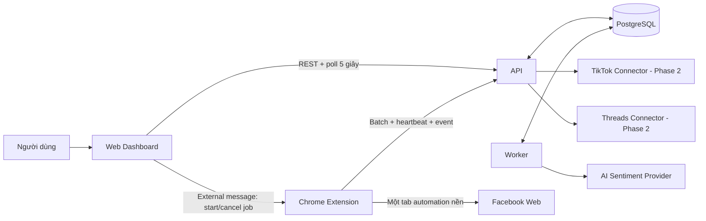
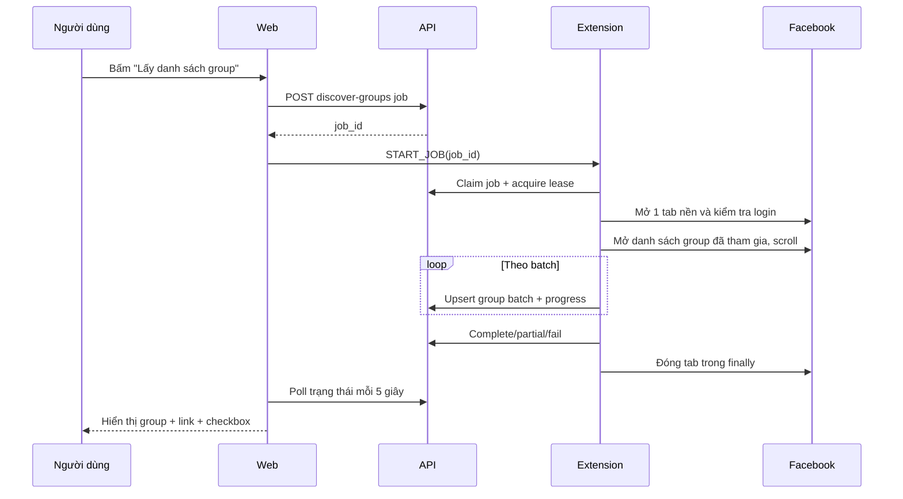
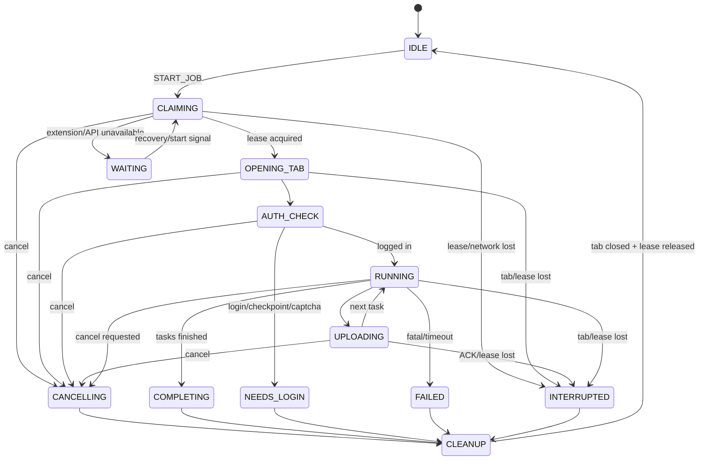

# Kế hoạch dự án `listening_socialmediav2`

> Phiên bản tài liệu: 1.1  
> Ngày lập: 2026-07-30  
> Trạng thái: Đang triển khai — cập nhật phạm vi comment-only  
> Phạm vi ưu tiên: Facebook end-to-end; TikTok và Threads chuẩn bị sẵn kiến trúc connector  
> Múi giờ nghiệp vụ: `Asia/Ho_Chi_Minh`

## 1. Tóm tắt dự án

`listening_socialmediav2` là hệ thống Social Listening để thu thập những nội dung liên quan đến Vinsmart Future trên:

- Facebook Group mà người dùng đã tham gia;
- TikTok;
- Threads.

Hệ thống lọc bài viết theo keyword, lưu metadata bài cha, lấy comment/reply liên quan, sau đó chỉ dùng AI để phân loại cảm xúc của comment/reply thành đúng ba nhãn:

- `positive`;
- `negative`;
- `neutral`.

Web là ứng dụng chính để cấu hình, khởi chạy, theo dõi và xem kết quả. Chrome Extension chỉ là agent chạy trong trình duyệt đã đăng nhập Facebook để:

- đồng bộ danh sách group;
- đi tới các group đã chọn;
- lấy bài viết và bình luận cần thiết;
- gửi dữ liệu theo batch về backend.

Extension không chứa dashboard, không lưu dữ liệu nghiệp vụ dài hạn và không gửi cookie, mật khẩu hoặc Facebook session về server.

> **Làm rõ ranh giới extension:** với group đã join/private, backend không có phiên Facebook để tự lấy comment. Vì vậy, nếu “extension chỉ lấy group + bài viết” được hiểu là không được đọc comment, chức năng crawl comment phải bỏ khỏi MVP hoặc thay bằng một API được cấp quyền. Kế hoạch này hiểu đúng vai trò mong muốn là extension chỉ làm **data collection agent** cho group, post và comment; toàn bộ cấu hình, business logic, AI, lưu trữ và dashboard vẫn nằm ở web/backend.

> **Quyết định phạm vi 1.1:** comment/reply là dữ liệu listening duy nhất. Post vẫn được đọc và lưu đủ source, URL, body, tác giả dạng name-only, thời gian đăng/thu thập, trạng thái parse thời gian và toàn bộ keyword khớp để làm metadata/ngữ cảnh cha. Extension hoàn toàn read-only: không nhập text, Like, Share, đăng bài hoặc gửi comment.

## 2. Các quyết định nền tảng

| Hạng mục | Quyết định |
|---|---|
| Cách triển khai | Modular monolith trong một monorepo |
| Web | vinext/React + TypeScript, tương thích Next App Router |
| API | Fastify + TypeScript |
| Worker | Node.js/TypeScript, dùng chung domain package với API |
| Database | PostgreSQL |
| Hàng đợi MVP | Bảng `sentiment_queue` dùng PostgreSQL locking; `crawler_slots` riêng cho extension lease |
| Extension | Chrome Manifest V3 + TypeScript |
| Chia sẻ contract | Zod schema + TypeScript types |
| AI | `SentimentProvider` độc lập nhà cung cấp |
| Cập nhật tiến độ MVP | Poll API mỗi 5 giây khi job đang hoạt động |
| Phạm vi release đầu | Facebook hoàn chỉnh; TikTok/Threads có Settings nhưng để feature flag |
| Auth MVP | Một workspace, một tài khoản admin; schema sẵn sàng mở rộng nhiều người dùng |
| Lịch chạy MVP | Chạy thủ công từ web; scheduler là phase sau |

Không thêm Redis trong MVP. `pg-boss` chỉ dùng cho worker job như sentiment/aggregate/cleanup; trạng thái crawl hiển thị cho người dùng vẫn nằm trong các bảng domain. Nếu tải thực tế chứng minh PostgreSQL queue không còn phù hợp thì mới tách queue ở phase scale.

## 3. Mục tiêu và chỉ số thành công

### 3.1. Mục tiêu sản phẩm

1. Người dùng ghép extension với web mà không cần cung cấp thông tin đăng nhập Facebook cho hệ thống.
2. Từ web, người dùng bấm lấy danh sách Facebook Group đã tham gia.
3. Web hiển thị tên group, link group và checkbox để chọn nguồn cần theo dõi.
4. Người dùng quản lý keyword và khoảng thời gian lấy dữ liệu.
5. Hệ thống chỉ xử lý những group đã chọn và ưu tiên những bài có keyword.
6. Tại mọi thời điểm, extension chỉ sở hữu tối đa một tab Facebook automation cho mỗi thiết bị/job và luôn đóng tab đang sở hữu khi kết thúc.
7. Dashboard thấy tiến độ mới chậm nhất 5 giây sau khi backend nhận cập nhật.
8. Comment/reply được AI gán sentiment, có confidence và thông tin model/prompt để truy vết; post chỉ là metadata/ngữ cảnh.

### 3.2. Chỉ số vận hành ban đầu

- `100%` job không có hơn một tab Facebook do extension sở hữu cùng thời điểm.
- `100%` đường kết thúc job gọi cleanup tab: thành công, một phần, lỗi, hủy, hết thời gian hoặc cần đăng nhập lại.
- Không có Facebook cookie/password/session token trong request hoặc log backend.
- Job chạy lại không tạo post/comment trùng.
- P95 API đọc trạng thái job dưới `500 ms` ở tải MVP.
- Dashboard phản ánh event mới trong tối đa `5 giây + độ trễ mạng`.
- Nội dung phân tích thành công luôn có đúng một trong ba nhãn sentiment.

## 4. Phạm vi

### 4.1. MVP Facebook — bắt buộc

- Web Settings có ba tab: Facebook, TikTok, Threads.
- Ghép/hủy ghép Chrome Extension.
- Hiển thị trạng thái extension: online, offline, đang chạy, cần đăng nhập.
- Nút `Lấy danh sách group`.
- Đồng bộ group mà tài khoản Facebook hiện tại có thể nhìn thấy trong danh sách đã tham gia.
- Hiển thị tên group, URL, trạng thái đồng bộ và checkbox chọn.
- Thêm, sửa, bật/tắt, xóa keyword.
- Có sẵn bốn keyword:
  - `VSF`;
  - `vinsmart Future`;
  - `Vinfuture`;
  - `Vin Future`.
- Khoảng thời gian:
  - Hôm nay;
  - 3 ngày gần nhất;
  - 7 ngày gần nhất;
  - 30 ngày gần nhất.
- Chạy crawl thủ công từ web.
- Lấy post khớp keyword trong group đã chọn.
- Chỉ lấy comment của post đã khớp keyword.
- Upsert dữ liệu, chống trùng và hỗ trợ chạy lại.
- AI sentiment chỉ cho comment/reply.
- Dashboard tiến độ và kết quả.
- Hủy job từ web.
- Docker Compose cho web, API, worker và PostgreSQL.

### 4.2. Phase 2 — TikTok và Threads

- Kết nối bằng API chính thức và quyền truy cập hợp lệ.
- Search nội dung theo keyword và khoảng ngày.
- Lấy comment/reply trong phạm vi API cho phép.
- Chuẩn hóa về cùng schema post/comment/sentiment.
- Dùng chung dashboard, worker AI và cơ chế chống trùng.

Trong MVP, hai tab này vẫn cho phép lưu keyword và lookback, nhưng nút crawl bị khóa với thông báo rõ `Connector chưa được cấu hình`.

### 4.3. Ngoài phạm vi MVP

- Không thu thập inbox, chat hoặc nội dung mà tài khoản không có quyền xem.
- Không tự nhập password, giải CAPTCHA, vượt 2FA/checkpoint hoặc né cơ chế chống automation.
- Không điều khiển nhiều tài khoản Facebook đồng thời trên cùng extension.
- Không cam kết thu thập 100% mọi post/comment mà Facebook đang lưu.
- Không crawl profile cá nhân ngoài phạm vi nguồn đã chọn.
- Không tự đăng bài, comment, like hoặc thực hiện tương tác xã hội.
- Không có mobile app.
- Không có scheduler chạy 24/7 khi máy người dùng/Chrome tắt.
- Không có báo cáo BI nâng cao hoặc cảnh báo đa kênh ở release đầu.

### 4.4. Truy vết yêu cầu

| ID | Yêu cầu gốc | Phần thiết kế/kiểm thử |
|---|---|---|
| REQ-01 | Extension + web, auto-click trong tab nền | Mục 6, 8, 9, 22.1 |
| REQ-02 | Docker + PostgreSQL | Mục 12, 18, 22.6 |
| REQ-03 | Settings ba nền tảng; Facebook lấy group, link và checkbox | Mục 7.2–7.4, 8.2, 22.2 |
| REQ-04 | Thêm keyword và bốn keyword mặc định | Mục 7.2, 14, 22.3 |
| REQ-05 | Hôm nay/3/7/30 ngày | Mục 5, 7.2, 22.3 |
| REQ-06 | Extension tối đa một tab Facebook đồng thời và cleanup | Mục 9.3–9.5, 22.1 |
| REQ-07 | Web là chủ lực, cập nhật crawl mỗi 5 giây | Mục 6.2, 8.5, 22.4 |
| REQ-08 | AI Positive/Negative/Neutral | Mục 15, 20.5, 22.5 |

## 5. Giả định nghiệp vụ

1. “Extension mở tối đa một tab Facebook” nghĩa là tối đa một tab automation do extension sở hữu **đồng thời**. Tab cũ bị người dùng/Chrome đóng có thể được thay thế sau khi extension xác nhận tab cũ không còn và lấy lại lease; không bao giờ tồn tại hai owned tab cùng lúc. Tab Facebook do người dùng tự mở không bị đóng hoặc chiếm quyền.
2. Tab automation được tạo với `active: false`, dùng tuần tự cho toàn bộ group/keyword của một job và được đóng trong khối cleanup bắt buộc.
3. Extension chỉ đọc nội dung đang hiển thị cho tài khoản Facebook đã đăng nhập trong Chrome.
4. `Hôm nay` tính từ `00:00:00` theo `Asia/Ho_Chi_Minh`.
5. `3/7/30 ngày gần nhất` là rolling window `N × 24 giờ`, tính lùi từ `job_created_at`; `window_start_utc` và `window_end_utc` được đóng băng trong snapshot. Riêng `Hôm nay` bắt đầu từ 00:00 theo timezone workspace và kết thúc tại `job_created_at`.
6. Keyword được trim, Unicode normalize và so sánh không phân biệt hoa/thường.
7. `VSF` mặc định dùng chế độ `whole_word`; các cụm còn lại dùng `contains_phrase`.
8. Một job giữ nguyên snapshot cấu hình dù người dùng sửa Settings trong lúc job đang chạy.
9. Kết quả được mô tả là “nội dung quan sát được qua giao diện/API tại thời điểm crawl”, không phải toàn bộ dữ liệu tuyệt đối của nền tảng.
10. Nếu Facebook yêu cầu đăng nhập lại, checkpoint hoặc CAPTCHA, job dừng an toàn và chuyển sang trạng thái cần người dùng xử lý; hệ thống không tìm cách vượt qua.

## 6. Kiến trúc tổng thể



### 6.1. Trách nhiệm từng thành phần

| Thành phần | Trách nhiệm | Không chịu trách nhiệm |
|---|---|---|
| Web | Settings, chọn group, tạo/hủy job, theo dõi tiến độ, dashboard | Đọc DOM Facebook |
| API | Auth, pairing, validate request, job state, ingest, query dữ liệu | Giữ Facebook session |
| Worker | Normalize, keyword validation, AI sentiment, aggregate, retry | Auto-click Facebook |
| Extension | Nhận job, quản lý tab, điều hướng/click/scroll, extract, upload | Dashboard, AI, lưu dữ liệu dài hạn |
| PostgreSQL | Dữ liệu nghiệp vụ, event, lease, queue, audit | Lưu cookie/password Facebook |
| Platform connector | Chuyển dữ liệu từng nền tảng về schema chung | Thay đổi logic dashboard |

### 6.2. Vì sao dùng web làm control plane

- Mọi cấu hình và lịch sử job có nguồn sự thật duy nhất trong PostgreSQL.
- Extension có thể bị suspend theo vòng đời Manifest V3 nên không được giữ state quan trọng chỉ trong RAM.
- Web chủ động gửi lệnh tức thời sang extension khi người dùng bấm nút.
- Extension upload về API; web không chờ message ngược từ extension mà poll backend 5 giây/lần.
- Khi extension offline, job ở `waiting_extension`, không hiển thị sai là đang crawl.

## 7. Cấu trúc giao diện web

### 7.1. Điều hướng chính

```text
Dashboard
Listening
  ├─ Comments & replies
  └─ Sentiment review
Jobs
Settings
  ├─ Facebook
  ├─ TikTok
  └─ Threads
```

### 7.2. `Settings > Facebook`

#### Khối Kết nối extension

- Trạng thái: `Chưa ghép`, `Online`, `Offline`, `Đang crawl`, `Cần đăng nhập`.
- Extension version và lần heartbeat gần nhất.
- Nút `Tạo mã ghép extension`.
- Nút `Hủy ghép`.
- Cảnh báo nếu extension version không tương thích API contract.

#### Khối Nguồn dữ liệu

- Nút `Lấy danh sách group`.
- Thời điểm đồng bộ gần nhất.
- Tìm kiếm group theo tên.
- Checkbox chọn từng group.
- Checkbox chọn tất cả trên trang.
- Cột:
  - tên group;
  - link mở ở tab mới;
  - selected;
  - trạng thái active/inactive;
  - lần phát hiện gần nhất;
  - lỗi crawl gần nhất.
- Nút `Lưu lựa chọn`.

#### Khối Keyword

- Input dạng chips.
- Bật/tắt từng keyword thay vì buộc xóa.
- Kiểu match: `whole_word` hoặc `contains_phrase`.
- Không cho lưu bản trùng sau normalize.
- Bốn giá trị mặc định được seed khi tạo workspace.

#### Khối Thời gian và giới hạn

- Radio/select: hôm nay, 3, 7 hoặc 30 ngày.
- `Crawl comments`: mặc định bật.
- Hard limits mặc định:
  - tối đa `50` group/job;
  - tối đa `300` post được mở/group;
  - tối đa `500` comment/post;
  - tối đa `120` phút/job.
- Các hard limit đặt trong server config; chỉ admin mới được đổi.

#### Khối Hành động

- `Crawl ngay`.
- `Hủy job hiện tại`.
- Validation trước khi chạy:
  - extension online;
  - ít nhất một group đã chọn;
  - ít nhất một keyword đang bật;
  - không có Facebook job đang chạy trên cùng device.

### 7.3. `Settings > TikTok`

- Trạng thái connector/API credential.
- Keyword và lookback dùng cùng component với Facebook.
- Thông tin quyền API cần thiết.
- Nút test connection.
- Trong MVP: `Crawl ngay` bị disable bằng feature flag.

### 7.4. `Settings > Threads`

- Trạng thái Meta App/OAuth.
- Keyword và lookback dùng cùng component.
- Search mode mặc định: `RECENT`.
- Nút test connection.
- Trong MVP: `Crawl ngay` bị disable bằng feature flag.

### 7.5. Dashboard

- Tổng nội dung theo sentiment.
- Tỷ lệ positive/negative/neutral.
- Biểu đồ theo ngày.
- Breakdown theo platform, group/source và keyword.
- Bảng post/comment mới nhất:
  - platform;
  - source;
  - đoạn nội dung;
  - sentiment;
  - confidence;
  - ngày đăng;
  - link gốc.
- Bộ lọc ngày/platform/source/keyword/sentiment.
- Badge `Cần xem lại` cho confidence thấp.
- Widget job đang chạy:
  - bước hiện tại;
  - group/task hiện tại;
  - số post đã quét/khớp/lưu;
  - số comment đã lưu;
  - số sentiment hoàn tất/tổng;
  - heartbeat;
  - lỗi gần nhất;
  - nút hủy.

## 8. Các flow end-to-end

### 8.1. Ghép extension với web

1. Admin bấm `Tạo mã ghép extension`.
2. API tạo pairing code một lần, hết hạn sau 5 phút.
3. Người dùng nhập code trong popup extension.
4. Extension gửi code cùng installation ID công khai tới API.
5. API trả device token có scope hẹp.
6. Extension lưu token trong `chrome.storage.local`; server chỉ lưu token hash.
7. Extension gửi heartbeat.
8. Web hiển thị trạng thái online ở lần poll tiếp theo.

Pairing code hết hạn hoặc đã dùng không thể dùng lại. Hủy ghép sẽ revoke token ngay lập tức.

### 8.2. Lấy danh sách Facebook Group



Quy tắc dừng scroll:

- không phát hiện group mới sau một số vòng liên tiếp;
- đạt hard limit;
- job bị hủy;
- hết timeout;
- Facebook yêu cầu login/checkpoint;
- DOM adapter phát hiện trạng thái không an toàn.

Backend upsert group theo external ID; nếu không lấy được ID ổn định thì dùng canonical URL. Chỉ đánh dấu group không còn xuất hiện là `inactive` khi lần discovery có `coverage_status = complete`. Với lần scan `partial/unknown`, giữ nguyên trạng thái cũ và lưu `partial_reason`; không suy luận rằng group đã bị rời.

### 8.3. Crawl bài viết và bình luận Facebook

1. Web validate Settings và tạo `CRAWL_CONTENT` job.
2. API lưu snapshot:
   - selected group IDs;
   - keyword + match mode;
   - `window_start_utc` và `window_end_utc`;
   - timezone;
   - crawl comment flag;
   - hard limits;
   - adapter version.
3. Web gửi `START_JOB(job_id)` cho extension.
4. Extension claim job và nhận lease độc quyền.
5. Extension tạo đúng một background tab nếu chưa resume tab hợp lệ.
6. Trong từng group, extension dùng khả năng search theo keyword của group nếu giao diện có hỗ trợ.
7. Extension xử lý tuần tự từng `group × keyword`.
8. Với mỗi kết quả:
   - đọc canonical URL/external ID;
   - mở rộng text nếu cần;
   - đọc thời gian và `time_parse_status`;
   - loại nội dung ngoài time window;
   - chạy keyword match cục bộ;
   - upload post theo batch.
9. Chỉ với post khớp keyword:
   - mở permalink trong cùng tab;
   - chọn tất cả bình luận nếu giao diện cho phép;
   - mở rộng comment/reply đến hard limit;
   - upload comment theo batch.
10. Extension checkpoint sau mỗi task và gửi heartbeat định kỳ.
    - Checkpoint chỉ được tăng sau khi backend ACK batch tương ứng.
11. Backend upsert post context + comment, nhưng chỉ đưa comment/reply mới hoặc thay đổi vào queue sentiment.
12. Khi tất cả task kết thúc, extension báo complete/partial và đóng tab trong `finally`.
13. Worker tiếp tục sentiment; job chuyển `processing_ai`.
14. Khi queue sentiment của job kết thúc, job chuyển `completed` hoặc `partial`.

Một group lỗi không làm mất dữ liệu của group khác. Job có thể hoàn thành `partial` cùng danh sách task lỗi.

Nếu không parse chắc chắn timestamp, entity được lưu với `published_at = null` và `time_parse_status = unknown` để điều tra nhưng không xuất hiện trong listening result mặc định. Giới hạn `300 post/group` tính trên số post unique của cả group qua tất cả keyword, không nhân lại theo `group × keyword`; comment cap tính trên từng post unique đã match.

### 8.4. AI sentiment

1. Worker chỉ lấy comment/reply chưa phân tích; không claim post.
2. Tạo `analysis_input_hash` từ toàn bộ input thực tế: text, context post cha, topic/target, normalization version và analysis schema version.
3. Kiểm tra cache theo analysis input hash + provider + model + prompt version.
4. Loại bỏ author identifier trước khi gửi AI.
5. Với comment, gửi thêm ngữ cảnh ngắn của post cha.
6. Provider trả structured JSON.
7. Validate schema; retry có giới hạn nếu output sai hoặc lỗi tạm thời.
8. Lưu sentiment và cập nhật aggregate.
9. Confidence thấp vẫn giữ một trong ba nhãn nhưng gắn `needs_review = true`.
10. AI lỗi sau retry chuyển `analysis_failed`; raw content vẫn được giữ.

### 8.5. Cập nhật tiến độ trên web

- Khi job ở `queued`, `waiting_extension`, `running` hoặc `processing_ai`, web gọi:
  - `GET /api/v1/jobs/{jobId}`;
  - `GET /api/v1/jobs/{jobId}/events?after={sequence}`.
- Chu kỳ mặc định: 5 giây.
- Dùng `ETag` hoặc `after sequence` để tránh tải lại toàn bộ event.
- SLA `5 giây + network/render latency` chỉ áp dụng khi dashboard đang visible/foreground; browser có thể throttle timer của tab nền.
- Khi tab web được focus/visible trở lại, fetch ngay thay vì chờ chu kỳ kế tiếp.
- Khi lần poll thấy job ở trạng thái kết thúc, fetch trạng thái và event lần cuối rồi mới dừng polling.
- SSE/WebSocket chỉ là tối ưu phase sau, không phải điều kiện MVP.

## 9. Thiết kế Chrome Extension

### 9.1. Permission tối thiểu

```json
{
  "manifest_version": 3,
  "permissions": ["alarms", "storage", "tabs"],
  "host_permissions": [
    "https://www.facebook.com/*",
    "https://<api-domain>/*"
  ],
  "externally_connectable": {
    "matches": ["https://<web-domain>/*"]
  }
}
```

Dev và production dùng manifest/environment riêng. Ưu tiên static content script chỉ cho Facebook host; chỉ thêm permission `scripting` nếu technical spike chứng minh programmatic injection là bắt buộc. Không dùng `<all_urls>`, `cookies`, `webRequest` hoặc `debugger` nếu chưa có yêu cầu và phê duyệt riêng.

### 9.2. Module

| Module | Vai trò |
|---|---|
| `DevicePairing` | Pair/revoke token, installation identity |
| `ExternalBridge` | Nhận start/cancel/status request từ web origin allowlist |
| `JobRunner` | Chạy đúng một job tuần tự |
| `TabLeaseManager` | Sở hữu, kiểm tra và dọn một automation tab |
| `FacebookAdapter` | Navigate, click, scroll, extract |
| `BatchUploader` | Batch, retry, idempotency key |
| `CheckpointStore` | Lưu job/task/tab/cursor trong extension storage |
| `Heartbeat` | Renew backend lease và báo trạng thái |
| `Watchdog` | Timeout, stuck detection, auth/checkpoint detection |
| `RedactedDiagnostics` | Log kỹ thuật đã bỏ nội dung nhạy cảm |

### 9.3. Bất biến một tab

1. Mỗi installation chỉ có một local mutex.
2. Backend chỉ cấp một active lease Facebook cho một device; lease có token, fencing token tăng dần, TTL và heartbeat.
3. `automationTabId` và `ownerJobId` được lưu bền vững.
4. Chỉ `TabLeaseManager` được gọi `chrome.tabs.create`.
5. Mọi group và permalink dùng `chrome.tabs.update` trên cùng tab.
6. Không dùng `window.open` trong content script.
7. Chỉ đóng tab có đủ bằng chứng ownership:
   - tab ID khớp checkpoint;
   - owner job khớp;
   - tab do extension tạo.
8. Không đóng tab Facebook do người dùng mở.
9. `finally` luôn gọi cleanup khi success, partial, fail, cancel, timeout hoặc needs-login.
10. Khi service worker thức dậy, recovery kiểm tra:
    - job/lease còn hợp lệ thì resume;
    - lease hết hạn thì đóng tab mồ côi thuộc extension và đánh dấu job interrupted;
    - không tìm thấy tab thì resume bằng một tab mới sau khi reacquire lease.
11. Để tránh crash tạo orphan giữa lúc mở tab và lưu tab ID:
    - lưu runner ở phase `RESERVING_TAB`;
    - tạo tab nền trỏ tới extension-owned `runner.html`;
    - lưu tab ID/ownership;
    - điều hướng chính tab đó sang Facebook.
12. Nếu Facebook mở child tab từ automation tab, extension đóng đúng child tab đó và fail an toàn; không tác động tab không chứng minh được ownership.

### 9.4. State machine



### 9.5. Khả năng phục hồi Manifest V3

- Không giữ job state quan trọng chỉ trong global variable.
- Dùng `chrome.storage.local` cho checkpoint cần sống qua browser restart.
- Dùng `chrome.storage.session` cho cache không cần sống qua restart.
- Credential dài hạn đặt access level `TRUSTED_CONTEXTS`; content script không được đọc.
- Đăng ký listener đồng bộ khi service worker load.
- Mỗi lần startup/heartbeat, extension reconcile runner local với backend và hỏi job `waiting_extension/interrupted` có thể claim; external `START_JOB` chỉ là fast path, không phải tín hiệu duy nhất.
- Heartbeat trong lúc content script đang hoạt động.
- `chrome.alarms` 30–60 giây chỉ là recovery/watchdog, không dùng làm cơ chế cập nhật UI 5 giây.
- Upload batch nhỏ để một lần lỗi không mất toàn bộ job.
- Mọi API ghi hỗ trợ idempotency.
- Mọi batch/checkpoint kèm lease token và fencing token; backend từ chối stale runner sau takeover.
- Message từ web chỉ mang `jobId + nonce`; extension tải snapshot đã validate từ backend, không thực thi selector, JavaScript hoặc arbitrary URL do webpage gửi.

### 9.6. Quy tắc DOM automation

- Ưu tiên canonical `href`, URL pattern, `aria-*` và role hơn class CSS ngẫu nhiên.
- Adapter có version; selector tách khỏi orchestration.
- Có fixture HTML đã làm sạch dữ liệu để test từng selector.
- Mỗi action có timeout, expected state và error code cụ thể.
- Dừng ngay ở CAPTCHA/checkpoint/2FA; không bypass.
- Không chạy song song group hoặc keyword trong nhiều tab.
- Throttle ở mức an toàn và có jitter nhỏ để tránh tạo tải dồn, nhưng không có cơ chế che giấu automation.

## 10. Connector theo nền tảng

| Nền tảng | Cách lấy dữ liệu dự kiến | Phạm vi release | Điều kiện bật |
|---|---|---|---|
| Facebook | Extension trong Chrome đã đăng nhập, chỉ nội dung được phép xem | MVP | Phê duyệt nội bộ về quyền/điều khoản và UAT bằng tài khoản test |
| TikTok | API chính thức phù hợp use case; ưu tiên Research API nếu đủ điều kiện | Phase 2 | App/Research access được duyệt, credential và quota hợp lệ |
| Threads | Threads API OAuth + keyword search/replies trong quyền được cấp | Phase 2 | Meta App, quyền liên quan và App Review hợp lệ |

Mọi connector implement cùng interface:

```ts
interface SocialConnector {
  validateConnection(): Promise<ConnectionStatus>;
  discoverSources(input: DiscoverSourcesInput): Promise<SourcePage>;
  searchPosts(input: SearchPostsInput): Promise<PostPage>;
  listComments(input: ListCommentsInput): Promise<CommentPage>;
}
```

Facebook adapter chạy phía extension; TikTok/Threads adapter chạy phía backend. Cả ba trả về DTO chuẩn hóa chung trước khi ghi database.

TikTok cần feasibility spike riêng: Research API có keyword/comment nhưng không phải quyền truy cập thương mại đại trà và chỉ mở cho hồ sơ đủ điều kiện. Nếu dự án không đủ điều kiện, connector phải dùng một kênh được TikTok phê duyệt hoặc dừng ở import hợp lệ; không thay bằng scraping không được phép. Threads keyword search cũng chỉ bật sau khi Meta App/OAuth và các quyền thực tế đã pass.

## 11. Job model và trạng thái

### 11.1. Loại job

- `DISCOVER_SOURCES`;
- `CRAWL_CONTENT`;
- `ANALYZE_SENTIMENT`;
- `REBUILD_AGGREGATES`;
- `DELETE_EXPIRED_DATA`.

### 11.2. Trạng thái job

```text
queued
  -> waiting_extension
  -> running
  -> processing_ai
  -> completed

Nhánh phục hồi:
claiming/opening/running/uploading
  -> interrupted
  -> waiting_extension
  -> running

Nhánh hành động/kết thúc:
needs_login
partial
cancelled
failed
```

`interrupted` là trạng thái có thể phục hồi khi tab bị đóng, browser restart, mất lease hoặc mất heartbeat. Cancel có thể được yêu cầu từ mọi trạng thái chưa kết thúc; timeout/lease-lost từ `claiming`, `opening`, `running` hoặc `uploading` đều phải hội tụ về cleanup rồi `interrupted`, `partial` hoặc `failed` theo khả năng resume. `needs_login` giữ job/action context nhưng không giữ tab/lease.

Không dùng `completed` nếu còn AI task bắt buộc chưa xử lý. Nếu crawl xong nhưng một phần content phân tích lỗi sau retry, job kết thúc `partial`.

### 11.3. Progress contract

```json
{
  "stage": "running",
  "currentSource": "Tên group",
  "sourcesTotal": 10,
  "sourcesDone": 4,
  "tasksTotal": 40,
  "tasksDone": 17,
  "postsScanned": 320,
  "postsMatched": 18,
  "postsSaved": 18,
  "commentsSaved": 246,
  "sentimentTotal": 264,
  "sentimentDone": 180,
  "lastHeartbeatAt": "2026-07-30T10:00:00Z"
}
```

Các counter chỉ tăng theo transaction hoặc được tính lại idempotently; retry không được làm counter tăng sai.

## 12. Mô hình dữ liệu PostgreSQL

### 12.1. Bảng chính

| Bảng | Mục đích / trường quan trọng |
|---|---|
| `workspaces` | Tenant boundary, timezone, retention |
| `users` | Admin/viewer, password hash/session metadata |
| `extension_devices` | installation ID, token hash, version, status, last seen, current job |
| `platform_connections` | platform, status, encrypted credential reference, metadata |
| `platform_settings` | platform, lookback preset, crawl comment flag, limits |
| `keywords` | value, normalized value, match mode, active |
| `sources` | platform, external ID, name, canonical URL, active, last discovered |
| `monitored_sources` | workspace + source + selected |
| `crawl_jobs` | type, platform, status, settings snapshot, progress, error, timestamps |
| `crawl_tasks` | job, source, keyword, state, attempt, checkpoint, lease |
| `crawl_events` | sequence, job, level, type, safe payload, timestamp |
| `crawler_slots` | device, platform, job, lease token hash, fencing token, lease expiry |
| `ingest_batches` | idempotency key, job, checksum, received count |
| `posts` | platform, external ID, source, URL, body, published/collected time, author name, anonymous flag/kind |
| `comments` | platform, external ID, post, parent comment, body, published/collected time, author name, anonymous flag/kind |
| `keyword_hits` | keyword + entity reference + match excerpt |
| `sentiment_analyses` | entity, analysis input hash, relevance, label, confidence, provider/model/prompt/schema version |
| `sentiment_overrides` | human label, reason, actor, timestamp |
| `audit_logs` | security/settings/admin actions |

### 12.2. Ràng buộc unique

- `(workspace_id, platform, normalized_value)` trên keyword.
- `(workspace_id, platform, external_id)` trên source.
- `(workspace_id, platform, external_id)` trên post.
- `(workspace_id, platform, external_id)` trên comment.
- `(job_id, sequence)` trên event.
- `(job_id, idempotency_key)` trên ingest batch.
- `(entity_type, entity_id, analysis_input_hash, provider, model, prompt_version, schema_version)` trên sentiment.
- Một partial unique active lease cho `(extension_device_id, platform = facebook)`.
- `crawler_slots` có primary key `(extension_device_id, platform)`; takeover luôn tăng `fencing_token`.

### 12.3. Index cần có

- `posts(platform, published_at DESC)`.
- `comments(post_id, published_at)`.
- `crawl_jobs(workspace_id, status, created_at DESC)`.
- `crawl_events(job_id, sequence)`.
- `sentiment_analyses(label, analyzed_at DESC)`.
- `keyword_hits(keyword_id, entity_type, entity_id)`.
- GIN/trigram cho text search nội bộ khi khối lượng dữ liệu đủ lớn.

### 12.4. Retention và dữ liệu cá nhân

- Không lưu cookie/password/session Facebook.
- Chỉ lưu tên hiển thị tác giả, `is_anonymous` và `author_kind = real|anonymous|unknown`.
- Không thu thập/lưu platform author ID, username/handle, avatar URL hoặc profile URL; tên tác giả không được render thành link.
- Nhận diện ẩn danh theo nhãn VN/EN hiển thị trên Facebook; không suy luận danh tính từ DOM ID, ảnh hoặc request mạng.
- Raw diagnostic DOM bị tắt mặc định; nếu bật để debug phải redact và tự xóa trong 7 ngày.
- Dữ liệu content mặc định giữ 180 ngày; cấu hình được theo workspace.
- Audit log giữ tối thiểu 365 ngày.
- Có job xóa dữ liệu hết hạn và khả năng xóa theo source/job.

## 13. API dự kiến

### 13.1. Auth và extension

| Method | Endpoint | Mục đích |
|---|---|---|
| `POST` | `/api/v1/extension/pairing-codes` | Tạo code một lần |
| `POST` | `/api/v1/extension/pair` | Ghép extension |
| `DELETE` | `/api/v1/extension/devices/{id}` | Revoke device |
| `POST` | `/api/v1/extension/heartbeat` | Trạng thái/renew lease |
| `GET` | `/api/v1/extension/status` | Web đọc trạng thái |

### 13.2. Settings và sources

| Method | Endpoint | Mục đích |
|---|---|---|
| `GET` | `/api/v1/settings/{platform}` | Đọc Settings |
| `PUT` | `/api/v1/settings/{platform}` | Lưu Settings |
| `GET` | `/api/v1/keywords` | Danh sách keyword |
| `POST` | `/api/v1/keywords` | Thêm keyword |
| `PATCH` | `/api/v1/keywords/{id}` | Sửa/bật/tắt |
| `DELETE` | `/api/v1/keywords/{id}` | Xóa keyword |
| `GET` | `/api/v1/sources?platform=facebook` | Danh sách group |
| `PUT` | `/api/v1/sources/selection` | Lưu checkbox |

### 13.3. Jobs

| Method | Endpoint | Mục đích |
|---|---|---|
| `POST` | `/api/v1/jobs/discover-sources` | Tạo job lấy group |
| `POST` | `/api/v1/jobs/crawl` | Tạo job crawl |
| `GET` | `/api/v1/jobs/{id}` | Trạng thái/progress |
| `GET` | `/api/v1/jobs/{id}/events` | Event sau sequence |
| `POST` | `/api/v1/jobs/{id}/cancel` | Yêu cầu hủy |
| `POST` | `/api/v1/extension/jobs/{id}/claim` | Extension claim + lease |
| `POST` | `/api/v1/extension/jobs/{id}/batches` | Ingest batch idempotent |
| `POST` | `/api/v1/extension/jobs/{id}/events` | Gửi event/progress |
| `POST` | `/api/v1/extension/jobs/{id}/complete` | Complete/partial |
| `POST` | `/api/v1/extension/jobs/{id}/fail` | Fail/needs-login |

### 13.4. Listening và dashboard

| Method | Endpoint | Mục đích |
|---|---|---|
| `GET` | `/api/v1/listening/posts` | Metadata post cha; sentiment luôn `null` |
| `GET` | `/api/v1/listening/comments` | Comment/reply kèm toàn bộ context post và keyword |
| `GET` | `/api/v1/dashboard/summary` | KPI sentiment comment/reply |
| `GET` | `/api/v1/dashboard/timeline` | Chuỗi thời gian comment/reply đã parse |
| `POST` | `/api/v1/sentiment/comment/{entityId}/override` | Human override cho comment/reply |

Mọi endpoint ghi dùng request ID; ingest batch bắt buộc có `Idempotency-Key`. Extension token chỉ có quyền extension endpoints, không có quyền admin Settings.

## 14. Keyword filtering

### 14.1. Normalize

```text
trim
-> Unicode NFKC
-> collapse whitespace
-> locale-aware lowercase
```

Không bỏ dấu tiếng Việt mặc định vì có thể tạo false positive; có thể bổ sung alias có/không dấu như keyword riêng.

### 14.2. Match hai lớp

1. Extension prefilter để giảm dữ liệu và số lần mở post.
2. Backend chạy lại cùng shared matcher trước khi lưu `keyword_hit`.

Backend là nguồn sự thật. Shared test vectors phải đảm bảo extension và backend trả cùng kết quả.

### 14.3. Quy tắc

- `whole_word`: phù hợp `VSF`, dùng biên Unicode-aware.
- `contains_phrase`: phù hợp cụm từ.
- Post phải match ít nhất một keyword đang bật trong snapshot.
- Comment không bắt buộc lặp lại keyword vì ngữ cảnh nằm ở post cha.
- Lưu keyword nào đã match để dashboard filter chính xác.

## 15. AI sentiment

### 15.1. Contract

```json
{
  "isRelevant": true,
  "label": "positive",
  "confidence": 0.91,
  "reason": "Nội dung thể hiện đánh giá tích cực.",
  "language": "vi"
}
```

`label` chỉ nhận `positive`, `negative`, `neutral`. Lỗi vận hành nằm ở `analysis_status`, không tạo nhãn sentiment thứ tư.

Nội dung có `isRelevant = false` vẫn giữ tri-state label để đúng contract, nhưng mặc định bị loại khỏi KPI sentiment/listening; UI cho phép mở bộ lọc xem lại các false match này.

### 15.2. Input

- Comment/reply: comment text + đoạn ngữ cảnh ngắn từ post cha.
- Post không được phân tích sentiment; chỉ dùng làm metadata/ngữ cảnh.
- Không gửi group member ID, author ID hoặc dữ liệu ghép extension.
- Giới hạn độ dài và cắt theo chiến lược ổn định.

### 15.3. Độ tin cậy

- `confidence < 0.60`: `needs_review = true`.
- Human override không ghi đè bản AI; lưu thành record audit riêng.
- Dashboard dùng effective label: override mới nhất nếu có, nếu không dùng AI label.
- Có tập đánh giá tiếng Việt gồm:
  - khen trực tiếp;
  - chê trực tiếp;
  - thông tin trung tính;
  - phủ định;
  - so sánh;
  - slang;
  - mỉa mai;
  - comment chỉ hiểu khi có post cha.

### 15.4. Kiểm soát chi phí

- Cache theo toàn bộ analysis input hash + provider + model + prompt/schema version; comment giống chữ nhưng khác post cha không được dùng chung cache.
- Chỉ phân tích comment/reply của post đã match; không phân tích post.
- Batch nếu provider hỗ trợ.
- Theo dõi token/request/cost theo job.
- Budget guard theo ngày và theo job.
- Khi hết budget, job `partial` và dữ liệu chờ phân tích không bị xóa.

## 16. Bảo mật, quyền riêng tư và tuân thủ

### 16.1. Cổng bắt buộc trước UAT Facebook

Meta công khai rằng tự động thu thập dữ liệu Facebook khi chưa có sự cho phép có thể vi phạm điều khoản. Vì vậy trước khi bật crawl trên tài khoản thật cần:

1. Xác nhận use case và quyền truy cập với chủ dữ liệu/workspace.
2. Rà soát điều khoản Meta và yêu cầu pháp lý tại nơi vận hành.
3. Chỉ thử nghiệm bằng tài khoản và group được phép.
4. Ghi rõ mục đích, retention và ai được xem dữ liệu.
5. Không triển khai kỹ thuật né phát hiện, CAPTCHA, rate limit hoặc checkpoint.

Nếu không có cơ sở cho automation, thay Facebook connector bằng phương án được cấp quyền chính thức hoặc luồng import dữ liệu hợp lệ. Đây là release gate, không phải việc để xử lý sau production.

### 16.2. Biện pháp kỹ thuật

- HTTPS bắt buộc ngoài localhost.
- Password dùng Argon2id hoặc provider auth tương đương.
- Session cookie: `HttpOnly`, `Secure`, `SameSite=Lax/Strict`.
- CSRF protection cho session-authenticated mutation.
- Extension token ngắn quyền, rotate/revoke được.
- Secret chỉ qua environment/secret manager.
- Credential TikTok/Threads mã hóa at rest.
- CORS và `externally_connectable` allowlist chính xác origin.
- Rate limit auth, pairing, job start và ingest.
- Validate Zod ở mọi trust boundary.
- Log redaction.
- Audit thay đổi Settings, device, job và human override.
- Backup PostgreSQL mã hóa và kiểm tra restore định kỳ.

## 17. Cấu trúc monorepo dự kiến

```text
listening_socialmediav2/
├─ apps/
│  ├─ web/
│  ├─ api/
│  ├─ worker/
│  └─ extension/
├─ packages/
│  ├─ contracts/
│  ├─ database/
│  ├─ domain/
│  ├─ sentiment/
│  ├─ platform-core/
│  ├─ ui/
│  ├─ config/
│  └─ test-fixtures/
├─ infra/
│  ├─ docker/
│  └─ scripts/
├─ docs/
│  ├─ architecture/
│  ├─ api/
│  ├─ operations/
│  └─ compliance/
├─ .env.example
├─ compose.yaml
├─ package.json
├─ pnpm-workspace.yaml
└─ PROJECT_PLAN.md
```

Extension build ra artifact riêng; extension không chạy trong Docker.

## 18. Docker Compose

### 18.1. Services

| Service | Vai trò |
|---|---|
| `postgres` | Database + queue |
| `api` | REST API |
| `worker` | Sentiment, aggregate, cleanup |
| `web` | Next.js web |
| `migrate` | One-shot migration trước khi API nhận traffic |

### 18.2. Yêu cầu

- Healthcheck riêng cho PostgreSQL, API, worker và web.
- Named volume cho PostgreSQL.
- API/worker không đồng thời tự chạy migration.
- `migrate` hoàn tất trước API/worker.
- Có `.env.example`, không commit secret.
- Local developer chạy được bằng:

```bash
docker compose up --build
```

- Extension dùng API localhost qua dev manifest.
- Production đặt reverse proxy/TLS bên ngoài hoặc thêm service proxy có cấu hình rõ ràng.

## 19. Biến môi trường dự kiến

```text
NODE_ENV=
APP_BASE_URL=
API_BASE_URL=
DATABASE_URL=
SESSION_SECRET=
EXTENSION_ALLOWED_ORIGINS=
EXTENSION_TOKEN_PEPPER=
DATA_HASH_SALT=
ENCRYPTION_KEY=
SENTIMENT_PROVIDER=
SENTIMENT_MODEL=
SENTIMENT_API_KEY=
SENTIMENT_DAILY_BUDGET=
FACEBOOK_JOB_TIMEOUT_MINUTES=
DATA_RETENTION_DAYS=
LOG_LEVEL=
```

Không đưa Facebook username/password/cookie vào `.env`.

## 20. Chiến lược kiểm thử

### 20.1. Unit test

- Keyword normalize/match.
- Date window, timestamp parsing và timezone.
- Job state transition.
- Lease acquire/renew/release.
- Tab ownership/cleanup.
- Batch idempotency.
- DTO/schema validation.
- Sentiment structured-output parser.
- Confidence/review/effective label.

### 20.2. Integration test

- API + PostgreSQL migration.
- Pairing code một lần và revoke device.
- Chỉ một active Facebook lease/device.
- Upsert group/post/comment.
- Retry cùng idempotency key.
- Worker retry và cache sentiment.
- Hủy job và stale heartbeat.
- Retention cleanup.

### 20.3. Extension test

- Playwright Chromium với trang fixture mô phỏng:
  - danh sách group;
  - group search result;
  - post rút gọn;
  - comment/reply;
  - login required;
  - checkpoint/CAPTCHA marker;
  - DOM thiếu selector;
  - infinite scroll dừng.
- Kiểm tra không tạo tab thứ hai.
- Kiểm tra tab đóng ở mọi terminal state.
- Restart service worker giữa job và resume từ checkpoint.
- Không gửi field nhạy cảm trong batch.

CI không tự crawl Facebook thật. Live UAT chỉ chạy thủ công trong phạm vi đã được cho phép.

### 20.4. Web E2E

- Lưu bốn keyword mặc định.
- Thêm/xóa/bật/tắt keyword.
- Chọn group và giữ lựa chọn sau reload.
- Tạo job khi hợp lệ.
- Chặn tạo job khi extension offline/không có group/keyword.
- Poll progress 5 giây.
- Hủy job.
- Filter dashboard.
- Human sentiment override.

### 20.5. AI evaluation

- Bộ dữ liệu nhãn tay ban đầu tối thiểu 200 mẫu tiếng Việt.
- Tách train/prompt-tuning và holdout evaluation.
- Ghi confusion matrix cho ba nhãn.
- Chưa release nếu bộ holdout chưa được người phụ trách nghiệp vụ duyệt.
- Theo dõi drift theo model/prompt version.

## 21. Milestone và task graph

Ước lượng dưới đây cho một kỹ sư full-stack có kinh nghiệm, chưa tính thời gian chờ duyệt quyền từ nền tảng.

| Mốc | Nội dung | Phụ thuộc | Ước lượng |
|---|---|---|---:|
| M0 | Chốt compliance, UX và tiêu chí dữ liệu | Không | 2–3 ngày |
| M1 | Monorepo, Docker, PostgreSQL, migration, CI | M0 | 3–4 ngày |
| M2 | Auth admin, Settings, keyword, source schema | M1 | 4–5 ngày |
| M3 | Extension pairing, heartbeat, bridge, single-tab lease | M1–M2 | 5–7 ngày |
| M4 | Facebook group discovery + selection | M3 | 5–7 ngày |
| M5 | Facebook post/comment crawl + checkpoint + ingest | M4 | 8–12 ngày |
| M6 | AI sentiment, cache, review, aggregates | M2 + M5 | 5–7 ngày |
| M7 | Dashboard, progress polling, cancel, errors | M3 + M5 + M6 | 4–6 ngày |
| M8 | Hardening, privacy, fixture/E2E/UAT, runbook | M7 | 5–7 ngày |
| M9 | TikTok connector | M8 + API approval | 6–10 ngày |
| M10 | Threads connector | M8 + API approval | 5–8 ngày |

Facebook MVP dự kiến khoảng `41–58 developer-days`. Ba nền tảng dự kiến khoảng `52–76 developer-days`, chưa tính lead time App Review/Research access và thời gian sửa adapter khi UI nền tảng thay đổi.

### 21.1. Thứ tự build chi tiết

#### M0 — Discovery và release gates

- Xác nhận tên brand/topic và bốn keyword mặc định.
- Xác nhận phạm vi group/tài khoản dùng cho UAT.
- Duyệt retention và dữ liệu tác giả.
- Chốt AI provider/budget.
- Chốt domain local/staging/production để build allowlist extension.
- Viết dữ liệu mẫu và acceptance test.

#### M1 — Foundation

- Khởi tạo Git/monorepo.
- TypeScript strict mode, lint, format, test.
- Compose services và healthcheck.
- Database migration workflow.
- Shared config/contracts.
- CI build/test.

#### M2 — Web/API Settings

- Admin auth.
- Ba tab Settings.
- Keyword CRUD/seed.
- Lookback settings.
- Source list/selection.
- Feature flags TikTok/Threads.

#### M3 — Extension core

- Manifest V3.
- Pairing popup.
- External bridge allowlist.
- Device heartbeat.
- Job claim/lease.
- Single-tab manager.
- Checkpoint/watchdog/cleanup.

#### M4 — Group discovery

- Facebook auth state detector.
- Joined-groups adapter.
- Scroll/dedupe/canonical URL.
- Batch ingest/progress.
- Web table + checkbox/link.

#### M5 — Crawl engine

- Job/task snapshot.
- Group search by keyword.
- Date parsing/time-window validation.
- Post extractor.
- Comment/reply extractor.
- Batch idempotency.
- Resume/cancel/partial error.

#### M6 — Sentiment

- Provider interface.
- Structured prompt/versioning.
- Worker queue/retry.
- Cache/cost guard.
- Aggregates.
- Review/override.

#### M7 — Dashboard

- Job widget.
- 5-second polling/event cursor.
- Summary/timeline/source breakdown.
- Comment/reply filters kèm metadata post cha và keyword.
- Empty/loading/error/partial states.

#### M8 — Release hardening

- Security/privacy review.
- Extension fixture suite.
- API integration/E2E.
- AI holdout evaluation.
- Backup/restore test.
- Observability.
- UAT và runbook.

## 22. Acceptance criteria MVP

### 22.1. Extension và tab

- Một device không chạy đồng thời hai Facebook job.
- Không tồn tại đồng thời hơn một Facebook automation tab do extension sở hữu; tab thay thế chỉ được tạo sau khi tab cũ đã được xác nhận không còn và lease được reacquire.
- Tab được mở nền và mọi task bình thường dùng lại cùng tab.
- Khi Chrome đang hoạt động, tab extension tạo đóng ngay sau mọi terminal state; nếu browser crash/tắt đột ngột, startup reconciliation dọn đúng owned tab ngay lần Chrome/extension hoạt động lại.
- Extension không đóng tab người dùng tự mở.
- Browser/service worker restart không tạo job hoặc tab trùng.
- Mất external `START_JOB` không làm mất job; extension nhận lại job ở lần startup/heartbeat/alarm tiếp theo.
- Stale runner sau lease takeover bị backend từ chối bằng fencing token.
- Backend không nhận Facebook cookie, password hoặc session token.

### 22.2. Group

- Bấm `Lấy danh sách group` tạo job và thấy tiến độ.
- Group thu được có tên và link hợp lệ.
- Group trùng chỉ có một dòng.
- Checkbox được giữ sau reload.
- Group không còn thấy chỉ được đánh dấu inactive sau một discovery `complete`; scan `partial/unknown` không thay đổi active state.
- Chưa login chuyển `needs_login` và cleanup tab.

### 22.3. Settings

- Có đủ ba tab Facebook/TikTok/Threads.
- Facebook active; TikTok/Threads thể hiện đúng trạng thái feature flag.
- Có sẵn đúng bốn keyword yêu cầu.
- Keyword normalize và không lưu trùng.
- Có đủ hôm nay/3/7/30 ngày.
- Job đang chạy không bị thay đổi bởi Settings mới.

### 22.4. Crawl

- Chỉ source đã tick được đưa vào snapshot.
- Chỉ post match ít nhất một keyword được lưu làm context; comment/reply mới là listening result.
- Post ngoài `window_start_utc..window_end_utc` không xuất hiện trong kết quả.
- Comment chỉ được lấy từ post match.
- Post context lưu source, URL, body, tác giả name-only/anonymous, thời gian đăng, thời gian thu thập, trạng thái parse và toàn bộ keyword khớp.
- Comment/reply lưu thời gian comment, thời gian thu thập, quan hệ comment cha và kế thừa keyword của post context khi hiển thị/lọc.
- Post/comment lưu được tên hiển thị và phân biệt `real|anonymous|unknown`.
- Extension không nhập text, Like, Share, đăng bài hoặc gửi comment; chỉ click allowlist nút xem/tải thêm nội dung.
- Payload có profile URL, platform author ID, username/handle hoặc avatar URL bị API từ chối; UI không tạo link từ tên tác giả.
- Retry không sinh duplicate.
- Một source lỗi không xóa dữ liệu source khác.
- Cancel từ web làm extension dừng, checkpoint, release lease và đóng tab.
- Khi dashboard đang visible, progress backend mới xuất hiện trên web trong `5 giây + network/render latency`; focus lại tab sẽ fetch ngay và terminal state luôn có final fetch.
- Mất heartbeat quá TTL không tiếp tục hiển thị giả là đang chạy bình thường.

### 22.5. AI

- Phân tích thành công có đúng một nhãn positive/negative/neutral.
- Chỉ `entity_type = comment` được queue/claim để phân tích.
- Có confidence, relevant, provider/model và prompt version.
- Analysis input/provider/model/prompt/schema không đổi thì không gọi AI lại.
- Confidence thấp được đưa vào review.
- AI lỗi không làm mất post context/comment.
- Bộ holdout tiếng Việt được duyệt trước release.

### 22.6. Hạ tầng

- `docker compose up --build` khởi động stack sau khi điền `.env`.
- Migration chạy được trên database mới.
- Healthcheck pass.
- Backup có thể restore vào database test.
- Log không chứa secret hoặc Facebook session.

## 23. Rủi ro và giảm thiểu

| Rủi ro | Mức | Giảm thiểu |
|---|---|---|
| Automation không phù hợp điều khoản Facebook | Rất cao | Compliance gate, chỉ dùng phạm vi được phép, ưu tiên API/luồng được cấp quyền |
| Facebook đổi DOM/React markup | Cao | Adapter version, selector theo URL/ARIA, fixture tests, diagnostic redact |
| Comment “Most relevant”, ẩn hoặc lazy-load | Cao | Chọn all-comments khi có, expand tới cap, công khai coverage thực |
| Group search bị ranking, không theo thời gian tuyệt đối | Cao | Lưu crawl method, time-window validation backend, không cam kết 100% coverage |
| Background tab bị throttle | Cao | Watchdog, timeout, checkpoint, cảnh báo cần foreground nếu gặp |
| MV3 service worker suspend | Cao | Persistent checkpoint, backend lease, idempotent API, alarms recovery |
| Login hết hạn/2FA/CAPTCHA | Cao | `needs_login`, cleanup, hướng dẫn người dùng; không bypass |
| Extension đóng nhầm tab | Cao | Ownership record; chỉ `TabLeaseManager` được đóng tab |
| Rò rỉ dữ liệu cá nhân | Cao | Chỉ lưu display name + anonymous flag, cấm profile link/ID, encryption, RBAC, retention, redaction |
| Duplicate do retry | Trung bình | Unique constraints, upsert, idempotency key |
| Sentiment sai với mỉa mai/slang | Trung bình | Context, confidence, holdout tiếng Việt, human review |
| AI cost tăng | Trung bình | Prefilter, cache, batch, budget guard |
| TikTok/Threads không được cấp quyền | Cao | Feature flag, connector boundary, không giả lập chức năng |
| Máy/Chrome tắt giữa job | Trung bình | Lease TTL, resume checkpoint; UI hiển thị interrupted |

## 24. Observability và runbook

### 24.1. Metrics

- Job theo status/platform.
- Job duration và partial/failure rate.
- Extension heartbeat age.
- Active/stale lease.
- Posts scanned/matched ratio.
- Comment coverage thực tế.
- Batch retry/idempotency hit.
- Selector failure theo adapter version.
- AI latency/error/cost/cache hit.
- Poll API latency.

### 24.2. Structured log fields

```text
request_id
workspace_id
job_id
task_id
device_id
platform
adapter_version
event_type
error_code
duration_ms
```

Không log raw cookie, access token, pairing code, full author identity hoặc toàn bộ DOM.

### 24.3. Alert cơ bản

- Extension mất heartbeat khi job đang chạy.
- Lease quá TTL.
- Selector failure vượt ngưỡng.
- Job failure/partial tăng đột biến.
- AI provider error/budget vượt ngưỡng.
- Database disk/connection cao.
- Backup hoặc retention job thất bại.

## 25. Definition of Done

Một milestone chỉ hoàn tất khi:

- code đã review;
- migration và rollback/forward-fix đã kiểm tra;
- unit/integration test liên quan pass;
- web state loading/empty/error đã xử lý;
- log và metric đủ để chẩn đoán;
- không có secret/PII mới trong log;
- tài liệu API/runbook được cập nhật;
- acceptance criteria tương ứng có bằng chứng;
- không còn lỗi P0/P1;
- release gate về quyền nền tảng đã được đáp ứng.

MVP chỉ được gọi là hoàn tất khi toàn bộ acceptance criteria ở mục 22 pass trong môi trường staging và UAT đã ký xác nhận.

## 26. Các quyết định còn cần chủ dự án xác nhận

Những mục này không chặn việc dựng foundation; giá trị trong cột “Mặc định đề xuất” sẽ được dùng nếu chưa có quyết định khác.

| Quyết định | Mặc định đề xuất |
|---|---|
| Tên topic chuẩn | `Vinsmart Future` |
| Số người dùng MVP | 1 admin |
| Crawl thủ công hay lịch | Thủ công trong MVP |
| Lưu tên tác giả | Có, chỉ display name; không profile link/ID/handle |
| Retention content | 180 ngày |
| Comment cap | 500/post |
| AI confidence review | `< 0.60` |
| AI provider/model | Qua `SentimentProvider`, chọn bằng env |
| Nơi deploy | Local/staging trước; production sau UAT |
| TikTok/Threads | Feature flag off đến khi có quyền API |

## 27. Tài liệu kỹ thuật tham chiếu

- [Chrome Tabs API](https://developer.chrome.com/docs/extensions/reference/api/tabs)
- [Chrome extension service worker lifecycle](https://developer.chrome.com/docs/extensions/develop/concepts/service-workers/lifecycle)
- [Chrome extension message passing và externally connectable](https://developer.chrome.com/docs/extensions/develop/concepts/messaging)
- [Chrome Storage API](https://developer.chrome.com/docs/extensions/reference/api/storage)
- [pg-boss: PostgreSQL-backed job queue](https://github.com/timgit/pg-boss)
- [Meta: How We Combat Scraping](https://about.fb.com/news/2021/04/how-we-combat-scraping/)
- [Facebook Terms](https://www.facebook.com/terms)
- [Facebook Automated Data Collection Terms](https://www.facebook.com/legal/automated_data_collection_terms)
- [TikTok Research API: Getting Started](https://developers.tiktok.com/doc/research-api-get-started/)
- [TikTok Research API: Query Video Comments](https://developers.tiktok.com/doc/research-api-specs-query-video-comments)
- [Meta Threads API collection: Keyword Search](https://www.postman.com/meta/threads/request/34203612-b3b2c12a-7ce6-4d86-a3c6-6d31e3b66ea1)

Các API/quyền nền tảng có thể thay đổi. Phải kiểm tra lại tài liệu chính thức và quyền thực tế ngay trước khi bắt đầu connector tương ứng và trước mỗi release production.
