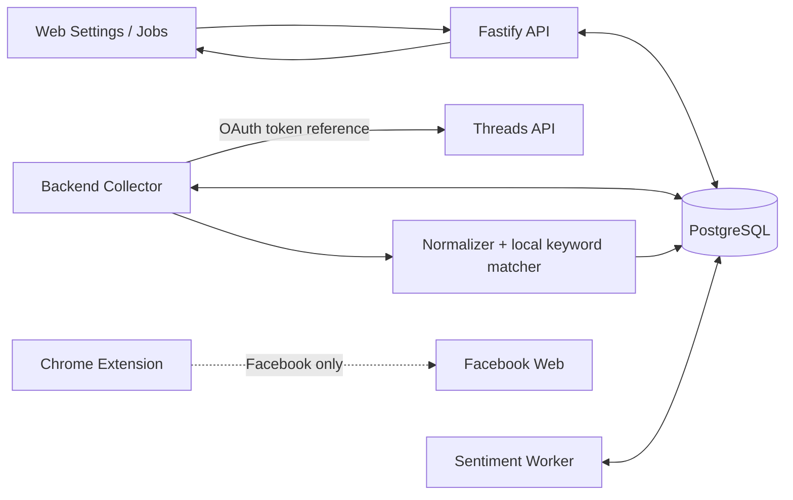

# Kế hoạch thu thập dữ liệu Threads cho `VinSmart Future`

> Ngày lập: 2026-08-04  
> Trạng thái: Trường hợp 1 đã có backend MVP; chờ token thật và App Review để UAT public  
> Phạm vi: Threads trước, TikTok lập kế hoạch riêng sau  
> Baseline: working tree của dự án ngày 2026-08-04

## 1. Kết luận và quyết định đề xuất

Phương án nên làm trước là **Threads API chính thức của Meta**, không dùng Chrome Extension và không scrape DOM trong bản production.

Luồng mục tiêu:

```text
Meta App + Threads OAuth
  -> App Review cho quyền keyword search
  -> poll public keyword search bằng RECENT
  -> phân trang và chống trùng theo Threads media ID
  -> is_reply = false: bài viết chứa keyword
  -> is_reply = true: reply/comment chứa keyword
  -> lấy cây conversation khi quyền thực tế cho phép
  -> match keyword cục bộ trên từng post/reply
  -> ingest vào schema chung
  -> dashboard + AI sentiment hiện có
```

Ba mức khả năng phải được phân biệt rõ:

| Mức | Mục tiêu | Đánh giá hiện tại |
|---|---|---|
| A | Tìm public post chứa keyword | API chính thức hỗ trợ qua `keyword_search`; đây là MVP chắc chắn nhất sau App Review. |
| B | Tìm reply/comment chứa keyword trực tiếp | Kết quả search có field `is_reply`; cần P0 kiểm chứng bằng dữ liệu test thật trước khi cam kết độ phủ. |
| C | Lấy toàn bộ cây reply của một public post đã tìm thấy | API có `/replies` và `/conversation`; quyền `threads_keyword_search` nói đến public content tree, nhưng tài liệu reply cũng có wording thiên về post của user đã OAuth. Bắt buộc P0 kiểm chứng trên post public không thuộc user OAuth. |
| D | Tìm mọi comment chứa keyword dù post gốc không chứa keyword | Không được cam kết là toàn bộ. Chỉ khả thi trong phần reply mà `keyword_search` trả trực tiếp hoặc trong các cây conversation đã được phát hiện bằng nguồn hợp lệ. |

Do Threads gọi comment là **reply**, tài liệu này dùng `reply/comment` cho cùng một loại entity.

## 2. Mục tiêu sản phẩm

### 2.1. Mục tiêu MVP

1. Kết nối một Threads account bằng OAuth mà không lưu password hoặc session trình duyệt.
2. Tìm public Threads media liên quan đến `VinSmart Future` theo keyword và cửa sổ thời gian.
3. Phân biệt rõ:
   - post match keyword trực tiếp;
   - reply match keyword trực tiếp;
   - reply chỉ được lấy làm ngữ cảnh vì post/reply cha đã match.
4. Lưu post, reply, quan hệ `root_post`/`replied_to`, thời gian, permalink và keyword hit theo schema hiện có.
5. Chống trùng khi cùng nội dung xuất hiện ở nhiều keyword, nhiều lần poll hoặc cả `TOP` và `RECENT`.
6. Dùng lại dashboard, PDF và sentiment worker sau khi dữ liệu được chuẩn hóa.
7. Hiển thị trung thực trạng thái coverage; không gọi kết quả là “toàn bộ Threads”.

### 2.2. Ngoài phạm vi

- Private profile, nội dung đã bị giới hạn quyền xem, inbox hoặc chat.
- Firehose toàn bộ Threads.
- Vượt CAPTCHA, checkpoint, rate limit hoặc biện pháp chống automation.
- Gọi private/internal GraphQL, giả user-agent, residential proxy hoặc reverse-engineered mobile API.
- Tự động post, reply, like, quote hoặc repost. Connector giai đoạn này là read-only.
- Cam kết tìm được mọi reply có keyword dưới một post gốc hoàn toàn không liên quan.

## 3. Hiện trạng repo

### 3.1. Phần đã sẵn sàng

- Enum dùng chung đã có `facebook | tiktok | threads` tại `packages/contracts/src/common.ts`.
- PostgreSQL đã có platform-neutral tables cho settings, connections, keywords, sources, jobs, posts và comments.
- Unique content key đã theo `(workspace_id, platform, external_id)`.
- `keyword_hits.entity_type` đã chấp nhận cả `post` và `comment`.
- Listening API, dashboard, PDF và sentiment worker phần lớn đã dùng schema chung.
- Settings và Jobs UI đã có nhãn Threads, hiện đang là placeholder.

### 3.2. Khoảng trống cần xử lý

- `packages/contracts/src/jobs.ts` chỉ cho tạo Facebook job.
- `services/api/src/routes/jobs.ts` luôn yêu cầu extension và đưa job vào `waiting_extension`.
- `services/api/src/ingest.ts` hard-code Facebook trong trusted scope, SQL và URL policy.
- Batch ingest chưa mang platform từ trusted job theo cách dùng được cho backend connector.
- Chưa có OAuth route, token refresh hoặc Threads client.
- Chưa có backend collector; `services/worker` hiện chỉ làm sentiment.
- `ingestCommentSchema` chưa có `matchedKeywordIds`.
- Comment view chưa trả `matchedKeywords` của chính comment.
- Pipeline hiện tại chỉ match keyword trên post; comment đang kế thừa keyword của post khi hiển thị.
- `posts.source_id` là bắt buộc, trong khi public keyword search không tương ứng với Facebook Group.
- Keyword trong database đang scope theo platform, nhưng UI hiện diễn đạt như keyword dùng chung.

### 3.3. Quyết định mặc định cho các khoảng trống

| Vấn đề | Quyết định đề xuất |
|---|---|
| Threads chạy ở đâu | Backend collector dùng API chính thức; không chạy trong extension. |
| Source của keyword search | Một synthetic source: `threads:public-keyword-search`. Query provenance lưu theo job/observation, không tạo một source cho mỗi keyword. |
| Keyword dùng chung hay riêng | Giữ platform-specific ở database; có thao tác “copy bộ keyword chuẩn sang Threads” để không phá schema hiện tại. |
| Username từ API | Không lưu. Mapper bỏ `username`, owner ID, profile URL và avatar để giữ privacy contract hiện có; author có thể là `unknown`. Raw permalink cũng phải được kiểm tra vì path thường chứa `@username`. |
| Keyword của comment | Chỉ ghi `keyword_hits(entity_type='comment')` khi body comment match trực tiếp. Keyword của post cha nằm trong `comment.post.matchedKeywords`, không giả làm hit của comment. |
| Runtime | Tạo backend collector loop riêng, dùng PostgreSQL claim/lock như kiến trúc hiện tại; không chạy crawl dài trong HTTP request. |

## 4. Các cách có thể lấy dữ liệu Threads

| Phương án | Post theo keyword | Reply/comment theo keyword | Độ ổn định | Tuân thủ | Vai trò đề xuất |
|---|---|---|---|---|---|
| Threads API chính thức | Có | Có dấu hiệu hỗ trợ qua `is_reply`; cần test live | Cao nhất | Cao nhất khi đúng permission/use case | **Primary** |
| API cho owned posts, replies và mentions | Chỉ quanh account đã OAuth | Tốt cho reply vào post của account đó | Cao | Cao | Bổ sung brand-owned monitoring |
| Threads native search + ghi nhận thủ công | Có nhưng bị ranking | Có thể mở thủ công từng conversation | Trung bình | Rủi ro thấp | Ground-truth/P0 |
| ActivityPub/fediverse | Chỉ public profile đã opt-in federation | Có trong phần activity được federate | Trung bình | Dựa trên chuẩn mở | Nguồn phụ, không backfill toàn cục |
| Search engine index/alerts | Chỉ nội dung được index | Rất thấp | Trung bình, có độ trễ | Tương đối thấp | Nguồn phát hiện phụ |
| Vendor social listening được Meta cấp quyền | Tùy vendor | Thường bị giới hạn; phải demo | Có thể cao | Phụ thuộc hợp đồng và data lineage | Fallback production có due diligence |
| Meta Content Library UI | Có dashboard keyword cho Threads | Chưa có cam kết rõ về Threads replies | Cao sau khi được cấp quyền | Chỉ nhóm nghiên cứu đủ điều kiện | Route đặc biệt, không phải connector thương mại mặc định |
| Browser automation/DOM scraping | Về kỹ thuật có thể | Có trên post đã mở | Dễ gãy | Cần Meta cho phép bằng văn bản | **Không bật production khi chưa có phép** |
| Internal GraphQL/private API | Có thể lấy được một phần | Có thể lấy subset | Rất dễ gãy | Rủi ro cao | **Loại khỏi thiết kế** |

### 4.1. Vì sao API chính thức là đường chính

API chính thức hiện có:

- OAuth và long-lived token;
- `GET /keyword_search`;
- `search_type=TOP|RECENT`;
- `search_mode=KEYWORD|TAG`;
- `since`, `until`, `limit`, cursor pagination;
- kết quả gồm các field như `id`, `text`, `timestamp`, `permalink`, `has_replies`, `is_reply`;
- `/replies` cho top-level replies;
- `/conversation` cho danh sách phẳng gồm top-level và nested replies;
- `root_post` và `replied_to` để dựng lại cây;
- App Review và permission contract rõ hơn các cách scrape.

Request P0 tối thiểu, dùng graph host và API version lấy từ cấu hình thay vì rải hard-code trong code:

```http
GET {THREADS_GRAPH_BASE_URL}/{API_VERSION}/keyword_search
  ?q=VinSmart%20Future
  &search_type=RECENT
  &search_mode=KEYWORD
  &fields=id,text,timestamp,shortcode,permalink,is_reply,has_replies
  &limit=100
Authorization: Bearer {THREADS_USER_ACCESS_TOKEN}
```

Khi cần hydrate ngữ cảnh:

```http
GET {THREADS_GRAPH_BASE_URL}/{API_VERSION}/{media-id}/conversation
  ?fields=id,text,timestamp,shortcode,permalink,is_reply,root_post,replied_to
Authorization: Bearer {THREADS_USER_ACCESS_TOKEN}
```

Hai request trên là probe design; danh sách field và graph host phải được đối chiếu với version/API response thật trong P0 trước khi đóng contract.

Quyền tối thiểu dự kiến:

- `threads_basic`;
- `threads_keyword_search`.

Quyền chỉ thêm khi P0 chứng minh cần:

- `threads_read_replies` cho owned-thread reply monitoring;
- không xin `threads_manage_replies`, `threads_content_publish` hoặc các write scope nếu sản phẩm chỉ đọc.

Nếu `threads_keyword_search` chưa qua App Review, search chỉ thấy nội dung của user đang OAuth. Vì vậy tester access đủ để phát triển với controlled fixtures, nhưng chưa đủ để UAT social listening public.

### 4.2. Giới hạn phải thiết kế ngay từ đầu

Tại ngày kiểm tra tài liệu 2026-08-04, keyword search có giới hạn được công bố là 2.200 query trên mỗi user trong rolling 24 giờ và quota được cộng dồn xuyên các app. Response tối đa 100 records. Con số này có thể thay đổi, vì vậy:

- không hard-code quota vào business logic;
- lưu quota policy trong connection metadata/config;
- mọi request đi qua một budget manager;
- repeated query, pagination và retry đều phải được tính ngân sách;
- có exponential backoff với jitter cho `429` và lỗi tạm thời;
- dừng an toàn trước khi cạn budget;
- dashboard phải phân biệt `no_result` với `not_queried_due_to_quota`;
- webhook không thay thế polling vì không có global keyword-match/firehose event.

### 4.3. Vì sao chưa chọn browser automation

Meta Automated Data Collection Terms yêu cầu express written permission cho automated collection. Việc chấp nhận điều khoản không tự tạo ra quyền đó. Vì vậy:

- manual search/capture có thể dùng để tạo ground-truth nhỏ;
- extension auto-click/scroll/export chỉ được xem lại nếu có phê duyệt pháp lý và permission bằng văn bản;
- không chuyển Facebook DOM adapter thành Threads DOM adapter như đường mặc định;
- không dùng vendor chỉ vì họ “scrape được”; phải xác minh nguồn dữ liệu và quyền sử dụng.

## 5. Chiến lược keyword cho `VinSmart Future`

### 5.1. Bộ query khởi đầu

Ưu tiên precision trước:

1. `VinSmart Future`
2. `VinSmartFuture`
3. `VSmart Future` — chỉ bật sau khi chủ sản phẩm xác nhận đây là alias đúng.
4. `VSF` — query recall, phải match `whole_word` và qua bộ lọc ngữ cảnh.

Không mặc định coi `VinFuture` hoặc `Vin Future` là alias của `VinSmart Future`, vì đây có thể là một entity/chương trình khác. Nếu vẫn cần theo dõi, đặt chúng thành keyword riêng và đo false-positive độc lập.

### 5.2. Hai lớp match

**Lớp 1 — platform discovery**

- Gửi từng query qua `/keyword_search`.
- Dùng `RECENT` cho polling thường xuyên.
- Dùng `TOP` ít thường xuyên để tìm content nổi bật mà RECENT window có thể bỏ qua.
- Dùng `since`/`until` theo snapshot cố định của job.

**Lớp 2 — local deterministic match**

- Unicode normalize `NFKC`.
- Trim và co nhiều khoảng trắng về một.
- So sánh không phân biệt hoa/thường.
- `VinSmart Future`: `contains_phrase`.
- `VSF`: `whole_word` và context guard.
- Lưu exact keyword ID, matched value, match mode và excerpt.
- API search result chỉ là candidate; database hit chỉ được ghi sau local match.

Context guard ban đầu cho `VSF` nên yêu cầu ít nhất một tín hiệu bổ sung như `Vin`, `VinSmart`, tên chương trình/sản phẩm đã xác nhận hoặc semantic relevance score vượt ngưỡng. Ground-truth P0 sẽ quyết định rule cuối.

### 5.3. Lịch poll khởi đầu

Đây là cấu hình thử nghiệm, không phải SLA cố định:

- high-precision query: mỗi 15–30 phút;
- recall query như `VSF`: mỗi 1–2 giờ;
- `TOP`: 1–2 lần/ngày;
- chừa tối thiểu 20% budget cho pagination, retry và kiểm tra thủ công;
- tự giảm tần suất khi hit rate thấp hoặc quota dùng chung tăng nhanh.

Job luôn lưu `query`, `search_type`, `since`, `until`, cursor, requested fields, API version, run time và số kết quả để có thể giải thích coverage.

## 6. Thiết kế cho post và comment keyword

### 6.1. Trường hợp 1 — post chứa keyword

```text
keyword_search
  -> result.is_reply = false
  -> local match post.body
  -> upsert post
  -> keyword_hits(post)
  -> nếu has_replies và quyền cho phép: fetch conversation
```

Các reply lấy từ conversation được lưu làm context. Reply chỉ có `keyword_hits(comment)` nếu chính body reply match.

### 6.2. Trường hợp 2 — reply chứa keyword

```text
keyword_search
  -> result.is_reply = true
  -> local match reply.body
  -> lấy root_post/replied_to hoặc fetch media details
  -> upsert post gốc tối thiểu
  -> upsert reply và parent chain quan sát được
  -> keyword_hits(comment)
```

Nếu API không trả đủ parent context, job giữ reply ở staging và thử hydrate context. Không tạo comment mồ côi trong bảng production.

### 6.3. Trường hợp 3 — post match, reply không chứa keyword

Reply vẫn có thể quan trọng, ví dụ `“mình cũng thấy rất tốt”`. Nó được lưu dưới post đã match để AI hiểu conversation context, nhưng:

- không gắn direct comment keyword hit;
- UI ghi `Ngữ cảnh từ bài viết` thay vì `Bắt được keyword`;
- filter `keywordId` phải định nghĩa rõ đang lọc direct hit hay post-context hit;
- báo cáo tách số lượng direct-match replies và contextual replies.

### 6.4. Giới hạn coverage

Ngay cả khi `is_reply=true` hoạt động, API search là một bề mặt discovery có ranking/quota, không phải firehose. Hệ thống phải dùng câu chữ:

> Nội dung public quan sát được qua Threads API trong các query và cửa sổ thời gian đã ghi nhận.

Không dùng câu:

> Toàn bộ bài viết và bình luận trên Threads.

## 7. P0 — feasibility spike bắt buộc

P0 phải hoàn thành trước khi refactor lớn hoặc gửi cam kết về comment coverage.

### 7.1. Chuẩn bị

1. Tạo Meta App với Threads use case.
2. Cấu hình OAuth redirect URI cho môi trường test.
3. Tạo/đăng ký Threads tester và lấy token chỉ với scope cần thiết.
4. Tạo controlled public fixtures, không dùng dữ liệu cá nhân thật:
   - `T1`: root post có `VinSmart Future`, replies không có keyword;
   - `T2`: root post không có keyword, top-level reply có keyword;
   - `T3`: root post không có keyword, nested reply có keyword;
   - `T4`: `VSF` đúng ngữ cảnh;
   - `T5`: `VSF` sai ngữ cảnh;
   - `T6`: Unicode/case/spacing variants.
5. Tạo thêm một public post từ account không authorize app để test public content tree sau App Review.

### 7.2. Test matrix

| Test | Kỳ vọng | Gate |
|---|---|---|
| Search own controlled post trước App Review | Chỉ scope tester/authorized content | Xác nhận môi trường dev đúng |
| Search public `T1` sau App Review | Nhận root post, permalink, timestamp | Gate A |
| Search `T2`/`T3` | Nhận reply với `is_reply=true` hoặc chứng minh không có | Gate B |
| `/{T1-id}/conversation` | Nhận top-level + nested replies, cursor | Gate C1 |
| Conversation của post không thuộc OAuth user | Thành công hoặc lỗi permission được ghi lại | Gate C2 |
| Pagination > 100 records | Không bỏ/trùng cursor page | Gate D |
| Duplicate qua nhiều keyword/TOP/RECENT | Một canonical entity, nhiều observations | Gate E |
| Token hết hạn/permission bị thu hồi | Job dừng an toàn, connection thành `error` | Gate F |

### 7.3. Artefact phải có

- Request/response fixtures đã redact token, owner ID, username và profile data.
- Bảng permission thực tế cho từng endpoint.
- Error code catalog.
- Kết quả Gate A–F.
- Mẫu 20–50 known post/reply pairs để dùng làm ground-truth regression.
- Quyết định Go/Conditional/No-go cho direct reply search và arbitrary public conversation expansion.

### 7.4. Cây quyết định sau P0

```text
Gate A pass?
  no  -> dừng implementation, xử lý App Review/use case
  yes -> ship post-keyword MVP

Gate B pass?
  yes -> bật direct reply keyword discovery
  no  -> chỉ tìm reply trong conversation của post seed

Gate C2 pass?
  yes -> hydrate public conversation tree
  no  -> chỉ hydrate owned posts hoặc direct reply context mà API cho phép
```

## 8. Kiến trúc đề xuất



### 8.1. Module mới

```text
services/collector/
  src/
    index.ts
    repository.ts
    scheduler.ts
    connectors/
      threads/
        client.ts
        auth.ts
        rate-limit.ts
        mapper.ts
        url-policy.ts
        connector.ts
```

Nếu chưa muốn tạo service mới, có thể mở rộng `services/worker` bằng một collector loop độc lập. Dù chọn cách nào, sentiment claim và Threads crawl claim phải tách queue/lock để một workload không chặn workload còn lại.

### 8.2. Connector contract

```ts
interface SocialConnector {
  validateConnection(): Promise<ConnectionStatus>;
  searchPosts(input: SearchPostsInput): Promise<PostPage>;
  listComments(input: ListCommentsInput): Promise<CommentPage>;
}
```

Với Threads:

- `searchPosts` gọi keyword search và có thể trả cả post/reply candidates;
- `listComments` gọi replies/conversation khi permission matrix cho phép;
- connector trả DTO platform-neutral trước khi ingest;
- API/collector lấy platform từ trusted job snapshot, không tin platform do payload ngoài gửi lên.

## 9. Mapping Threads API vào schema hiện tại

| Threads field | Schema đích | Quy tắc |
|---|---|---|
| `id` | `posts.external_id` hoặc `comments.external_id` | Dedupe key theo workspace + platform + external ID. |
| `shortcode` | `canonical_url` | Ưu tiên dựng content-only URL `https://www.threads.com/t/{shortcode}/`; P0 phải xác minh URL resolve đúng. |
| `permalink` | Staging memory | Dùng để đối chiếu P0 nhưng không lưu raw nếu path chứa `@username`; nếu short URL không khả dụng thì cần privacy decision hoặc đổi schema, không âm thầm lưu handle. |
| `text` | `body` | Trim; không nhận body rỗng nếu schema chưa hỗ trợ media-only content. |
| `timestamp` | `published_at` | Parse ISO; giữ invariant `time_parse_status`. |
| `is_reply=false` | `posts` | Candidate root/top-level post. |
| `is_reply=true` | `comments` | Chỉ ingest sau khi xác định được root post. |
| `root_post.id` | `comments.post_external_id` | Upsert root post trước comment. |
| `replied_to.id` | `parent_comment_external_id` | Dựng cây reply; null nếu reply trực tiếp root. |
| thứ tự API page | `observed_order` | Monotonic trong conversation observation; không coi là thứ tự tuyệt đối toàn nền tảng. |
| `username`, `owner.id` | Không lưu | Loại tại mapper/privacy boundary. |
| local matched keyword IDs | `keyword_hits` | Post và comment direct hits được ghi riêng. |

Synthetic source đề xuất:

```text
external_id: threads:public-keyword-search
name: Threads public keyword search
canonical_url: https://www.threads.com/search
```

Nếu sau này thêm watched profiles, mỗi profile có thể là một source riêng nhưng không lưu profile URL/handle khi privacy policy hiện tại chưa thay đổi.

## 10. Thay đổi mã nguồn dự kiến

### 10.1. Contracts

- Mở `createCrawlJobSchema` cho `threads` hoặc tạo discriminated union theo platform.
- Tạo Threads connection/OAuth schemas.
- Thêm `matchedKeywordIds` vào comment ingest DTO.
- Thêm `matchedKeywords` và `matchContext` vào comment view.
- Bổ sung progress fields: `apiCalls`, `pagesFetched`, `repliesScanned`, `repliesMatched`, `quotaDeferred`.

### 10.2. API và jobs

- Threads crawl job đi `queued -> running`, không qua `waiting_extension`.
- Giữ Facebook job flow nguyên vẹn.
- Snapshot đóng băng query set, window, search types, requested fields, limits và connector version.
- Tạo OAuth start/callback/disconnect/test-connection routes.
- Dùng `platform_connections.credential_reference`; không lưu token thô trong metadata/log.
- Thêm cancel/checkpoint/resume cho từng query + cursor.

### 10.3. Ingest

- Tách generic ingest khỏi Facebook URL policy.
- Tạo platform URL policy cho Threads, ưu tiên short content URL không chứa handle và normalize domain cũ/mới về canonical form đã quyết định.
- Trusted scope lấy `platform` từ job trong database.
- Upsert parent trước child; retry staging item nếu parent chưa hydrate được.
- Ghi direct post/comment hits độc lập.
- Không ghi inherited post keyword thành comment hit.

### 10.4. UI

Tab `Settings > Threads` cần:

- trạng thái OAuth connection và token expiry;
- nút Kết nối / Kết nối lại / Ngắt kết nối / Test;
- danh sách keyword cho Threads;
- lookback và poll mode;
- capability badges sau P0:
  - Public post keyword: available/unavailable;
  - Direct reply keyword: verified/unverified;
  - Public conversation expansion: verified/owned-only/unavailable;
- quota/budget và lần crawl gần nhất;
- thông báo coverage rõ ràng.

Dashboard cần:

- filter `Direct keyword hit` và `Post context`;
- chip keyword của chính reply tách khỏi chip keyword post cha;
- source badge Threads;
- cảnh báo partial/unknown coverage;
- không hiển thị username/profile identity nếu privacy contract không đổi.

## 11. OAuth, secrets và privacy

- Chỉ xin permission cần cho read-only MVP.
- Access token phải được mã hóa/đặt trong credential store; database chỉ giữ reference và metadata không nhạy cảm.
- Redact `access_token`, authorization code, app secret, owner/user IDs, username và username nằm trong raw permalink khỏi log/fixture.
- Có scheduled token refresh, expiry alert và re-auth flow.
- Khi disconnect, revoke nếu API hỗ trợ và xóa credential local.
- Không lưu password, browser cookie hoặc Threads session.
- Chỉ thu thập public content mà API trả trong use case đã được duyệt.
- Giữ data minimization hiện tại: không author ID, handle, profile URL hoặc avatar.
- Có retention, delete request và transition-to-private policy trước production.
- Việc xử lý dữ liệu cá nhân phải qua legal/privacy review theo pháp luật áp dụng; tài liệu này không thay thế tư vấn pháp lý.

## 12. Rate limit, checkpoint và observability

### 12.1. Checkpoint

```json
{
  "queryIndex": 0,
  "searchType": "RECENT",
  "windowStartUtc": "...",
  "windowEndUtc": "...",
  "afterCursor": "...",
  "pagesFetched": 0,
  "apiCalls": 0
}
```

Checkpoint chỉ được advance sau khi page đã ingest idempotently.

### 12.2. Metrics

- `threads_api_calls_total{endpoint,status}`
- `threads_keyword_results_total{query,search_type,is_reply}` với query được hash/allow-list để tránh cardinality cao
- `threads_pages_fetched_total`
- `threads_posts_saved_total`
- `threads_replies_saved_total`
- `threads_direct_reply_hits_total`
- `threads_duplicates_total`
- `threads_rate_limited_total`
- `threads_quota_deferred_total`
- `threads_token_expiry_seconds`
- `threads_connector_latency_ms`
- `threads_coverage_status{job}`

### 12.3. Coverage semantics

- `complete`: collector đi hết cursor mà API trả cho frozen query window; **không** có nghĩa là toàn bộ nội dung trên Threads.
- `partial`: dừng vì quota, timeout, cancel, permission hoặc page error.
- `unknown`: API không cung cấp đủ tín hiệu để xác nhận độ phủ/ranking.

## 13. Kiểm thử và acceptance criteria

### 13.1. Unit tests

- Threads URL canonicalization cho `threads.com` và `threads.net`, gồm short URL không chứa handle.
- Mapping post/reply/root/parent.
- Không rò username, owner ID, profile URL hoặc token.
- NFKC/case/spacing và whole-word `VSF`.
- Direct comment hit không bị nhầm với inherited post hit.
- Cursor/checkpoint serialization.
- Rate-limit budget/backoff.

### 13.2. Integration tests

- OAuth callback state/PKCE nếu flow hỗ trợ.
- Token refresh và revoked permission.
- Mock `keyword_search` với TOP/RECENT và nhiều pages.
- `is_reply=true` hydrate đúng root/parent.
- Conversation pagination giữ đủ nested replies.
- Chạy lại cùng job không tạo duplicate.
- Cùng entity qua nhiều keyword giữ nhiều keyword hits.
- `429`, `5xx`, timeout, malformed response và partial completion.
- Cancel job không để lock/claim treo.

### 13.3. Acceptance criteria MVP

- [ ] App Review cho public keyword search đã pass.
- [ ] Gate A pass: public post keyword search hoạt động.
- [ ] 100% result được local matcher xác nhận trước khi ghi keyword hit.
- [ ] Không có duplicate với cùng Threads ID.
- [ ] Token/secret/username/owner ID, kể cả username ẩn trong permalink, không xuất hiện trong DB business fields, logs hoặc fixtures.
- [ ] Job resume từ cursor không mất page và không ghi trùng.
- [ ] Dashboard phân biệt direct reply hit với post-context reply.
- [ ] Coverage text không tuyên bố dữ liệu toàn cục.
- [ ] Nếu Gate B/C2 không pass, tính năng tương ứng bị feature-flag off và UI ghi đúng giới hạn.
- [ ] Build/test toàn monorepo pass sau integration.

## 14. Milestone và thứ tự triển khai

Thời lượng dưới đây là engineering estimate, **không bao gồm thời gian Meta App Review**.

| Milestone | Nội dung | Ước lượng |
|---|---|---:|
| M0 | P0 controlled fixtures, OAuth test, permission matrix, Gate A–F | 2–4 ngày |
| M1 | Refactor platform-neutral job + ingest + URL policy | 3–5 ngày |
| M2 | OAuth connection, secret reference, token refresh | 3–5 ngày |
| M3 | Threads client, search pagination, budget, checkpoint, mapper | 4–6 ngày |
| M4 | Post keyword MVP + direct reply classification | 3–5 ngày |
| M5 | Conversation hydration + comment-local keyword hits | 3–5 ngày, conditional Gate C2 |
| M6 | Settings, Jobs, Dashboard, PDF integration | 3–5 ngày |
| M7 | UAT, privacy, observability, runbook, release hardening | 3–5 ngày |

Có thể làm song song M1–M3 trong lúc chờ App Review bằng mock server và fixtures đã redact. Production release vẫn bị chặn bởi Gate A.

## 15. Rủi ro và phương án giảm thiểu

| Rủi ro | Tác động | Giảm thiểu |
|---|---|---|
| App Review không pass/chậm | Không search public production | P0 sớm; demo đúng allowed use; không hứa deadline phụ thuộc Meta. |
| Direct reply không xuất hiện trong keyword search | Bỏ sót comment dưới root không match | Gate B; fallback chỉ scan conversation của post seed; công bố coverage. |
| Public conversation expansion bị giới hạn | Không có full tree cho arbitrary public post | Gate C2; owned-only mode hoặc vendor đã chứng minh quyền/coverage. |
| Search ranking/sampling | Recall không đầy đủ | Kết hợp RECENT/TOP, query variants, account/topic seeds, ground-truth measurement. |
| Quota dùng chung xuyên app | Job bị trì hoãn | Budget manager, adaptive schedule, reserved quota, alert. |
| Keyword `VSF` quá nhiễu | Precision thấp, tốn quota/AI | Whole-word + context guard + labeled dataset. |
| `VinFuture` bị coi nhầm là alias | Sai insight về entity | Tách keyword/entity và yêu cầu product owner xác nhận. |
| Token hết hạn/thu hồi | Collector ngừng | Refresh scheduler, expiry alert, safe re-auth. |
| API/version thay đổi | Connector lỗi | Version pin, contract tests, changelog watch, adapter version. |
| Dữ liệu cá nhân vượt scope | Privacy/compliance risk | Mapper closed shape, drop identity fields, retention/delete policy, review trước release. |
| Vendor quảng cáo quá mức | Chi phí cao nhưng thiếu replies | Known-case benchmark, data-lineage/DPA/SLA check trước hợp đồng. |

## 16. Fallback nếu API chính thức chưa đáp ứng comment

Thứ tự fallback:

1. **Post-first official mode:** tìm post keyword, lấy conversation trong phạm vi API cho phép, match reply cục bộ.
2. **Owned/mentions mode:** theo dõi post/reply quanh Threads account do dự án quản lý.
3. **Native search + manual review:** tạo ground-truth và xử lý high-priority URLs.
4. **ActivityPub supplement:** theo dõi tập public opt-in accounts phù hợp.
5. **Authorized enterprise vendor:** chỉ sau demo trên known test set và xác minh data lineage/quyền.
6. **Import hợp lệ:** CSV/JSON từ nguồn mà tổ chức có quyền sử dụng.

Không tự động chuyển sang scraping. Browser automation chỉ được mở thành dự án riêng sau khi có:

- express written permission phù hợp;
- legal/privacy approval;
- account/rate-limit policy;
- selector maintenance budget;
- kill switch và incident runbook.

## 17. Checklist đánh giá vendor

- Nguồn là Meta Public API, integration được cấp quyền hay scraping?
- Search toàn platform, topic-tag hay chỉ tập public profiles?
- Có trả direct replies từ keyword search không?
- Có top-level và nested replies không?
- Pagination tối đa và historical backfill là bao nhiêu?
- Có edit/delete/private-transition sync không?
- Có permalink, stable media ID, root ID và parent ID không?
- Có DPA, data lineage, retention, deletion SLA, indemnity và audit right không?
- Có cho chạy 20–50 known post/reply pairs trước khi mua không?
- Contract có cam kết reply coverage hay chỉ marketing page?

## 18. Việc cần làm ngay

1. Xác nhận product owner có coi `VSF`, `VSmart Future`, `VinFuture`, `Vin Future` là cùng entity hay không.
2. Tạo Meta App/Threads use case và tester account.
3. Chuẩn bị controlled fixtures T1–T6.
4. Viết P0 probe chỉ gọi API và lưu fixtures đã redact; chưa nối database production.
5. Ghi permission matrix và kết quả Gate A–F.
6. Nộp App Review cho `threads_keyword_search` với read-only social-listening demo.
7. Trong lúc chờ review, thực hiện M1–M3 bằng mock server.
8. Chỉ chốt SLA/coverage cho comment sau Gate B và C2.

### 18.1. Trạng thái triển khai trường hợp 1

Đã triển khai trong repo:

- `POST /api/v1/jobs/crawl` với `platform=threads`, không cần extension;
- synthetic source `threads:public-keyword-search`;
- worker gọi `keyword_search` bằng bearer token server-side, `RECENT`, frozen window
  và cursor pagination;
- chỉ ingest `is_reply=false`;
- local deterministic keyword match trước khi ghi `keyword_hits(post)`;
- URL policy chuyển permalink chứa handle thành short content URL và không lưu
  username/owner/raw permalink;
- checkpoint, retry lỗi tạm thời, cancel check, partial coverage và chống chạy hai
  Threads job đồng thời;
- seed keyword chính xác `VinSmart Future` cho Threads;
- unit tests cho request, matcher, root-post mapper và privacy URL boundary.

Chưa được coi là production-ready cho public search cho tới khi có token/app thật,
`threads_keyword_search` qua App Review và Gate A được chạy thành công. Hướng dẫn
cấu hình chi tiết nằm tại `docs/THREADS_SETUP.md`.

## 19. Tài liệu tham chiếu

Nguồn chính thức/primary:

- [Meta — Keyword and Topic Tag Search](https://developers.facebook.com/docs/threads/keyword-search/)
- [Meta — Threads Reply Management API](https://developers.facebook.com/docs/threads/reply-management)
- [Meta — permission `threads_keyword_search`](https://developers.facebook.com/docs/permissions/reference/threads_keyword_search/)
- [Meta — Threads Webhooks](https://developers.facebook.com/docs/threads/webhooks)
- [Meta official Postman — Keyword Search](https://www.postman.com/meta/threads/request/34203612-b3b2c12a-7ce6-4d86-a3c6-6d31e3b66ea1)
- [Meta official Postman — Full Conversation](https://www.postman.com/meta/threads/request/34203612-13ebe336-0176-4d2b-b208-c36646093139)
- [Meta official Threads API workspace](https://www.postman.com/meta/threads/overview)
- [Meta official sample app](https://github.com/fbsamples/threads_api)
- [Meta Automated Data Collection Terms](https://www.facebook.com/legal/automated_data_collection_terms)
- [Meta — Threads and the fediverse](https://about.fb.com/news/2024/06/what-is-the-fediverse/)
- [Meta — Meta Content Library and API](https://about.fb.com/news/2023/11/new-tools-to-support-independent-research/)

Nguồn phụ để đánh giá fallback/vendor, không được coi là bằng chứng Meta cấp phép:

- [BrandBastion — Threads keyword-listening limitations](https://help.brandbastion.com/en/articles/12087059-listen-to-keywords-on-threads)
- [Sprinklr — Threads keyword/topic-tag scope](https://www.sprinklr.com/help/articles/threads/threads-keyword-and-topic-tag-searches/695e6ff86e42ec4232384727)
- [Brandwatch — Threads data network](https://www.brandwatch.com/datanetworks/threads/)
- [Google Search operators](https://support.google.com/websearch/answer/2466433)
- [Google Alerts](https://support.google.com/websearch/answer/4815696)

Các giới hạn API có thể thay đổi. Trước mỗi milestone production phải kiểm lại Meta changelog, App Dashboard và response thực tế của app đã được duyệt.
