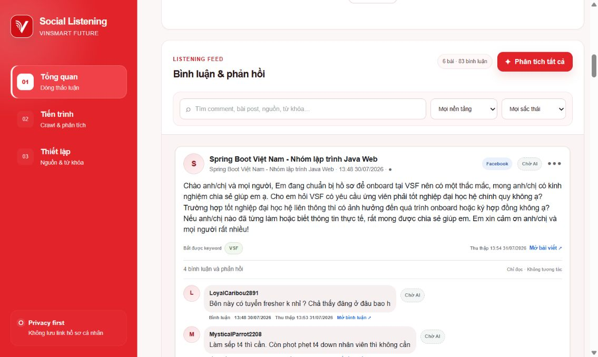
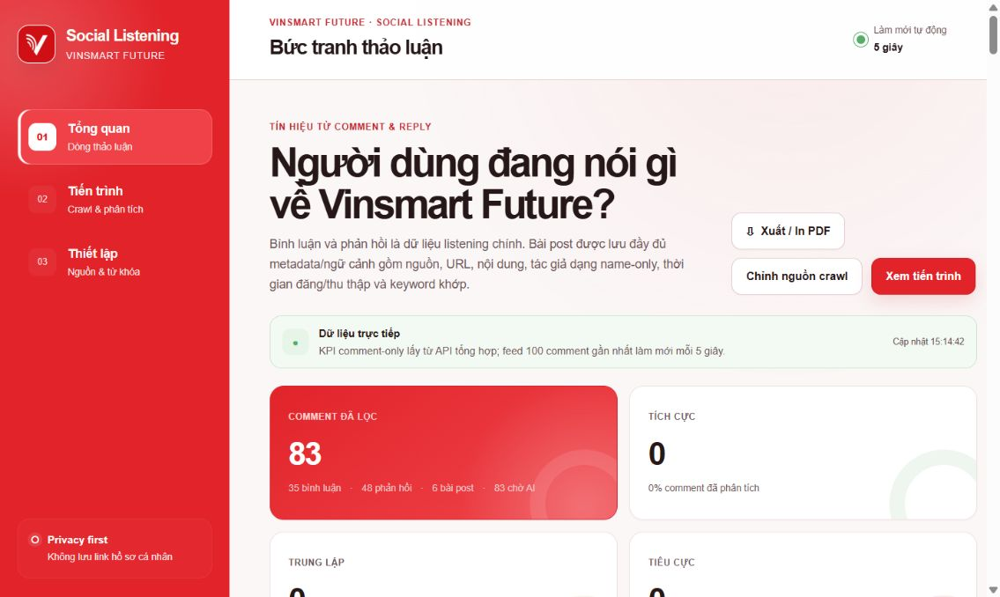
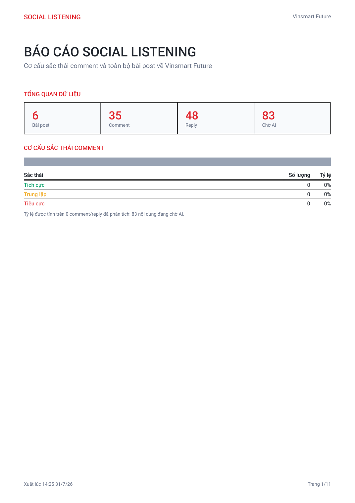
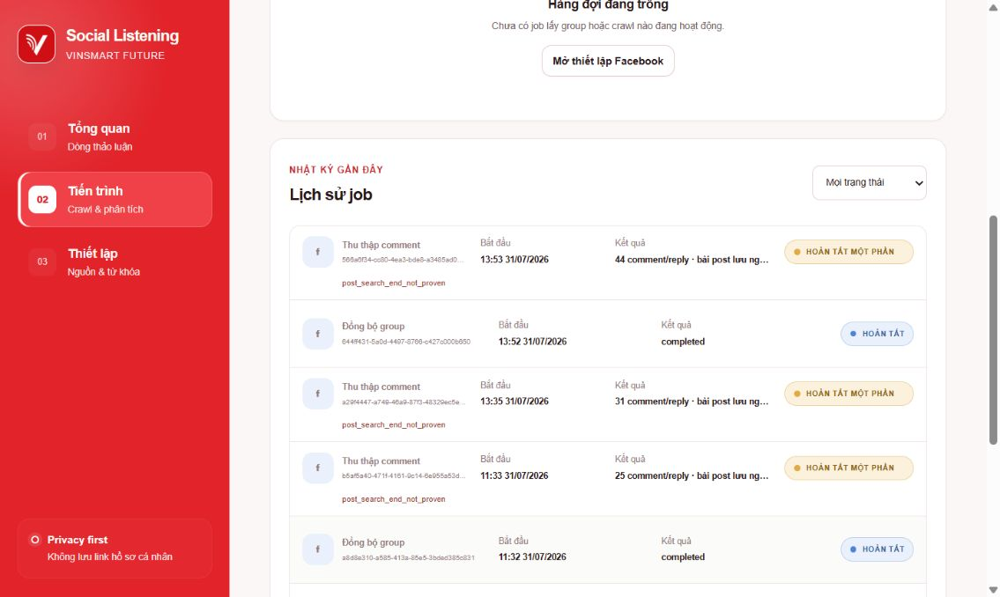
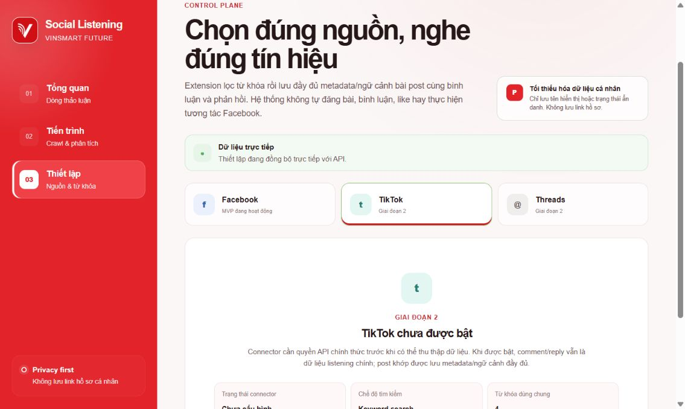
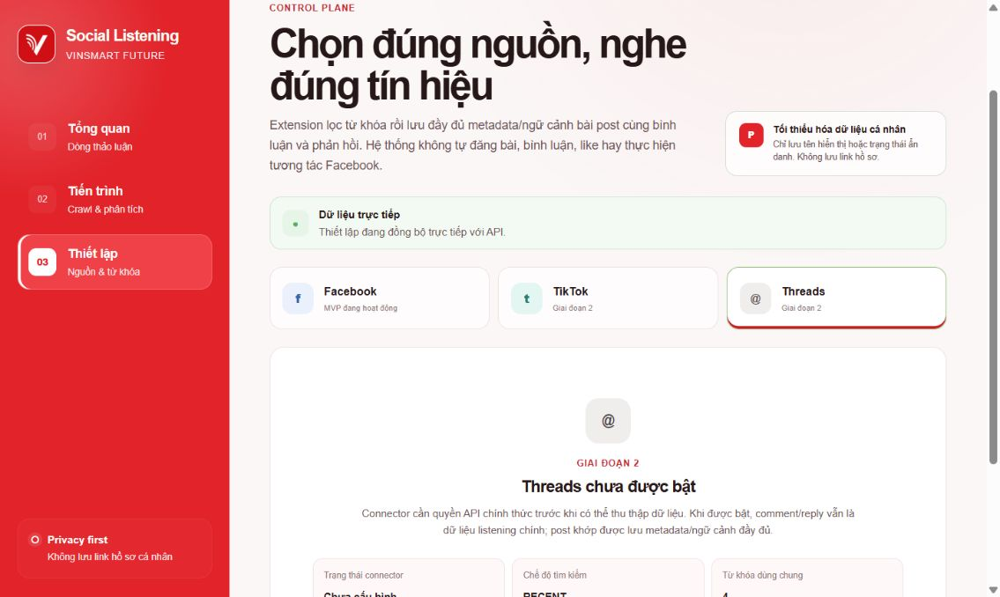
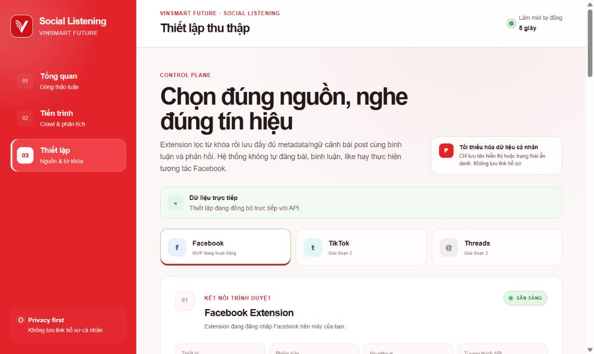
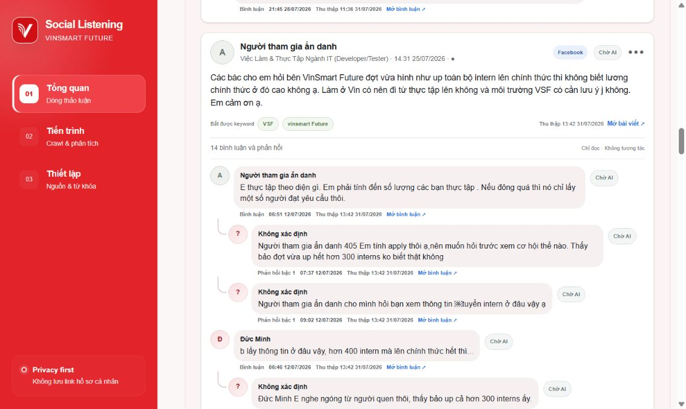

# Kịch bản slide báo cáo Sprint 1 — Social Listening

## Brief thiết kế dành cho ChatGPT

- **Đối tượng nghe:** mentor và team VinSmart Future.
- **Mục tiêu:** mentor hiểu MVP đã triển khai đến đâu, thống nhất trọng tâm Sprint 2–3 và bổ sung input cho pilot với team Tuyển Dụng.
- **Thông điệp:** Sprint 1 đã tạo được Facebook MVP; hai sprint tiếp theo tập trung cải thiện AI và mở rộng thu thập nội dung người dùng trên TikTok, Threads.
- **Thời lượng:** 10–12 phút, 11 slide, tỉ lệ 16:9.

### Quy chuẩn hình ảnh bắt buộc

- **Màu chủ đạo:** trắng `#FFFFFF` và đỏ sáng `#E2232A`.
- **Màu bổ trợ:** đỏ đậm `#B91C1C`, chữ than `#20252B`, xám rất nhạt `#F5F5F5`.
- Dùng màu đỏ cho tiêu đề, đường nhấn và số liệu chính; ảnh chụp sản phẩm giữ nguyên màu gốc.
- **Title deck:** 50–56 pt.
- **Title mỗi slide:** 36–42 pt.
- **Số liệu/callout:** 30–40 pt.
- **Nội dung:** 22–26 pt; không thu nhỏ chữ để nhồi thêm nội dung.
- Tối đa **3 ý chính/slide**, mỗi ý chỉ 1 dòng ngắn; riêng slide flow được dùng 5 nhãn bước thật ngắn.
- Ưu tiên khoảng **65% diện tích cho hình**, 35% cho chữ.
- Mỗi slide nội dung phải có ít nhất một ảnh, screenshot, sơ đồ hoặc con số lớn.
- Không đưa nguyên phần “Lời thoại gợi ý” lên slide; phần này phải nằm trong speaker notes.

### Tài nguyên ảnh lấy trực tiếp từ project

1. `public/social-listening-logo.png` — logo trang bìa.
2. `docs/images/social-listening-technology-stack-v2.png` — infographic công nghệ trắng–đỏ.
3. `docs/images/screenshots/01-dashboard-overview.png` — dashboard thật chụp từ Chrome.
4. `docs/images/screenshots/02-post-comment-feed.png` — feed bài post và comment.
5. `docs/images/screenshots/03-nested-reply-tree.png` — cây comment/reply của bài về tuyển dụng.
6. `docs/images/screenshots/04-jobs-progress.png` — trang tiến trình hệ thống.
7. `docs/images/screenshots/05-job-history.png` — lịch sử job thật.
8. `docs/images/screenshots/06-facebook-settings.png` — Settings và ba nền tảng.
9. `docs/images/screenshots/07-tiktok-settings.png` — trạng thái TikTok hiện tại.
10. `docs/images/screenshots/08-threads-settings.png` — trạng thái Threads hiện tại.
11. `docs/images/sprint1-pdf-report-preview.png` — preview báo cáo PDF thật.

### Lưu ý về dữ liệu

- Snapshot ngày 31/07/2026: **6 bài post · 35 comment · 48 reply · 83 nội dung chờ AI**.
- Nhãn AI cũ đã được reset để kiểm định lại; không tự tạo tỷ lệ tích cực/trung lập/tiêu cực.
- “Dữ liệu người dùng TikTok/Threads” trong deck được hiểu là **nội dung công khai hoặc được cấp quyền như bài đăng, comment, reply và metadata cần thiết**; không thu mật khẩu, session hoặc dữ liệu hồ sơ nhạy cảm.

---

## Slide 1 — Sprint 1 đã tạo được Facebook MVP

### Nội dung hiển thị

**SOCIAL LISTENING**

Facebook MVP · AI · Dashboard · PDF

`[Họ tên]` · `[Team]` · `[Ngày trình bày]`

### Hình ảnh và bố cục

- Nền trắng, mảng đỏ mềm ở một góc.
- Logo dự án ở trung tâm hoặc bên phải.
- Chỉ giữ tiêu đề, một dòng mô tả và thông tin người trình bày.

### Lời thoại gợi ý

> Sau Sprint 1, em đã chuyển bài toán Social Listening từ ý tưởng thành một Facebook MVP có thể chạy xuyên suốt. Hệ thống đã thu thập bài post, comment, reply; cho phép AI đánh giá nội dung; hiển thị kết quả trên dashboard và xuất báo cáo PDF. Trong phần này em sẽ trình bày kết quả hiện tại, hai sprint tiếp theo và input em cần từ mentor.

---

## Slide 2 — Mục tiêu là biến thảo luận thành tín hiệu về VSF

### Nội dung hiển thị

**Thu thập đúng**

**Hiểu đúng thái độ với VSF**

**Biến thành insight dễ dùng**

### Hình ảnh và bố cục

- Dùng screenshot feed thật dưới đây chiếm khoảng 70% slide.
- Đặt ba callout ngắn trên ảnh: **Post · Comment · Chờ AI**.
- Không tạo ảnh mô phỏng thay cho giao diện thật.

### Lời thoại gợi ý

> Bài toán không dừng ở việc lấy nhiều comment. Hệ thống phải thu thập đúng bài post và ngữ cảnh reply, sau đó đánh giá thái độ của từng nội dung đối với VSF. Output cuối cần đủ ngắn gọn để team nhìn ra tín hiệu tích cực, tiêu cực hoặc trung lập và có thể sử dụng trong báo cáo.

---

## Slide 3 — Project vận hành theo 5 bước

### Nội dung hiển thị

1. **Chọn nguồn & keyword**
2. **Tạo job crawl**
3. **Lấy post, comment, reply**
4. **Chuẩn hóa & lưu dữ liệu**
5. **AI đánh giá & hiện dashboard**

### Hình ảnh và bố cục

- Dùng một pipeline ngang 5 bước, mỗi bước là một hình/icon lớn.
- Bước 3 minh họa cây `Post → Comment → Reply`.
- Bước cuối gộp AI và dashboard trong cùng một khối, đúng flow dự án mới.
- Có một callout nhỏ ở dưới: **Read-only · Không like · Không đăng bài**.

### Lời thoại gợi ý

> Flow hiện tại có năm bước. Người dùng chọn nguồn, keyword và khoảng thời gian; web tạo job; extension lấy bài post, comment và reply; API chuẩn hóa rồi lưu vào PostgreSQL. Ở bước cuối, người dùng chủ động gọi AI đánh giá và xem kết quả trên dashboard. Em đã gộp AI và dashboard thành một phần output cuối vì đây là nơi dữ liệu được chuyển thành kết quả có thể đọc và kiểm tra.

---

## Slide 4 — Kiến trúc gọn nhưng đủ cho MVP

### Nội dung hiển thị

**Web · Extension · API · Database · AI · Docker**

`Một stack thống nhất bằng TypeScript`

### Hình ảnh và bố cục

- Dùng ảnh dưới đây chiếm 80–90% slide:

- Không tạo thêm danh sách công nghệ vì ảnh đã thể hiện đầy đủ.

### Lời thoại gợi ý

> Web là nơi điều khiển và xem kết quả. Chrome Extension thu thập dữ liệu trong phiên Facebook được phép. Fastify API xử lý nghiệp vụ, PostgreSQL lưu trữ, worker chạy AI và Docker Compose giúp chạy toàn bộ stack local. Các phần dùng chung contract TypeScript và Zod nên dữ liệu nhất quán từ extension đến dashboard.

---

## Slide 5 — Output hiện tại đã có dữ liệu thật và báo cáo

### Nội dung hiển thị

**6** bài post

**35** comment · **48** reply

**83** nội dung chờ AI

### Hình ảnh và bố cục

- Bên trái là ba số liệu lớn.
- Bên phải đặt screenshot dashboard thật; góc dưới chồng một preview PDF nhỏ.
- Nhấn trực tiếp button **Xuất / In PDF** có sẵn trong screenshot.

### Lời thoại gợi ý

> Snapshot hiện tại có 6 bài post, 35 comment và 48 reply. Toàn bộ 83 comment/reply đang chờ AI vì các label cũ đã được xóa để em và mentor có thể kiểm định lại. Hệ thống đã có dashboard, cây hội thoại và button xuất báo cáo PDF. File PDF hiện có thể chứa KPI, cơ cấu sắc thái và toàn bộ bài post cùng comment, reply.

---

## Slide 6 — Sprint 1 hoàn thành lõi, chưa kết thúc phần kiểm định

### Nội dung hiển thị

**Đã có:** Facebook end-to-end

**Đã có:** 110/110 test pass

**Cần tiếp tục:** AI và dữ liệu đa nền tảng

### Hình ảnh và bố cục

- Dùng ảnh lịch sử job thật chiếm khoảng 70% slide.
- Đặt badge lớn `110/110 tests pass` bên cạnh ảnh.
- Giữ trạng thái `Hoàn tất / Hoàn tất một phần` để nói trung thực về UAT.

### Lời thoại gợi ý

> Sprint 1 đã hoàn thành phần lõi của Facebook MVP và 110 test hiện đều pass. Tuy nhiên em chưa xem đây là sản phẩm hoàn chỉnh. Logic AI vẫn cần kiểm định bằng dữ liệu tiếng Việt, còn TikTok và Threads mới chỉ có phần chuẩn bị về kiến trúc. Đây sẽ là ba hướng chính của hai sprint tiếp theo.

---

## Slide 7 — Sprint 2: cải thiện AI và mở đường cho TikTok, Threads

### Nội dung hiển thị

**AI hiểu đúng ngữ cảnh hơn**

**TikTok/Threads có connector thật**

**PDF chỉ giữ thông tin cần dùng**

### Hình ảnh và bố cục

- Dùng hai screenshot thật TikTok và Threads đặt cạnh nhau.
- Giữ nguyên dòng **Giai đoạn 2 / chưa được bật** để thể hiện đúng khoảng trống hiện tại.
- Ba nhãn nhỏ bên dưới: **API hợp lệ · Comment/reply · AI dùng chung**.

### Lời thoại gợi ý

> Sprint 2 có ba mục tiêu. Thứ nhất, em tiếp tục chỉnh logic AI để phân biệt rõ thái độ với VSF, đặc biệt với reply ngắn, phủ định, so sánh và mỉa mai. Thứ hai, em ưu tiên nghiên cứu quyền truy cập và triển khai connector thật cho TikTok và Threads để lấy bài đăng, comment, reply trong phạm vi được phép. Thứ ba, em rà soát button xuất PDF; chỉ giữ hoặc bổ sung nội dung mà mentor và người dùng thực sự cần trong báo cáo.

### Chi tiết để đưa vào speaker notes, không hiển thị thành bullet trên slide

- Có bộ mẫu AI tiếng Việt đã gán nhãn để kiểm tra.
- TikTok và Threads lấy được dữ liệu thử nghiệm qua phương án hợp lệ.
- Có format PDF được mentor xác nhận là hữu ích.

---

## Slide 8 — Sprint 3: đưa TikTok và Threads vào cùng dashboard

### Nội dung hiển thị

**Facebook + TikTok + Threads**

**Một chuẩn dữ liệu**

**Một dashboard kết quả**

### Hình ảnh và bố cục

- Dùng screenshot Settings thật có đủ ba tab Facebook, TikTok và Threads.
- Thêm ba mũi tên từ các tab vào một khung **Dashboard chung**.
- Không tạo biểu đồ hoặc số liệu giả cho TikTok/Threads.

### Lời thoại gợi ý

> Sprint 3 tập trung hoàn thiện luồng đa nền tảng. Dữ liệu người dùng từ TikTok và Threads sẽ được chuẩn hóa về cùng cấu trúc bài post, comment và reply với Facebook. Sau đó AI dùng chung logic đánh giá, còn dashboard cho phép xem hoặc so sánh kết quả theo từng nền tảng. Đây là hạng mục quan trọng nhất của Sprint 3 vì nó quyết định dự án có thật sự trở thành Social Listening đa kênh hay không.

### Chi tiết để đưa vào speaker notes, không hiển thị thành bullet trên slide

- Chạy được một job TikTok và một job Threads end-to-end.
- Hiển thị nguồn nền tảng trên feed và dashboard.
- AI và PDF xử lý được dữ liệu từ cả ba nguồn.

---

## Slide 9 — Em cần mentor chốt ba loại input

### Nội dung hiển thị

**Nguồn dữ liệu được phép**

**Tiêu chí AI đánh giá đúng**

**Output nào thật sự cần dùng**

### Hình ảnh và bố cục

- Ba hình lớn: shield/data, AI label, dashboard/report.
- Mỗi hình chỉ có một câu hỏi ngắn:
  - Nguồn nào được dùng?
  - Nhãn nào là đúng?
  - Người dùng cần quyết định gì?

### Lời thoại gợi ý

> Em cần mentor hỗ trợ chốt ba nhóm input. Một là nguồn và quyền truy cập phù hợp cho Facebook, TikTok và Threads. Hai là một bộ mẫu tiếng Việt được gán nhãn để làm ground truth cho AI. Ba là xác định người dùng xem dashboard hoặc PDF để ra quyết định gì. Các input này giúp em không chỉ mở rộng kỹ thuật mà còn đo được kết quả có đúng và hữu ích hay không.

---

## Slide 10 — Đề xuất cho Tuyển Dụng: lắng nghe trải nghiệm ứng viên

### Nội dung hiển thị

**Ứng viên đang hỏi gì?**

**Họ vướng ở bước nào?**

**Team nên cải thiện nội dung gì?**

### Hình ảnh và bố cục

- Dùng ảnh cây reply thật của bài hỏi về thực tập và tuyển dụng tại VSF.
- Crop tập trung vào bài post và các nhánh ẩn danh; che display name nếu deck được chia sẻ ngoài team.
- Bên cạnh ảnh đặt output ngắn: **Top vấn đề · Sắc thái · Hành động đề xuất**.

### Lời thoại gợi ý

> Sau hai tuần ở VSF, bài toán em muốn đề xuất với team Tuyển Dụng là Candidate Voice: tổng hợp những câu hỏi và điểm vướng lặp lại trong hành trình ứng viên. Nguồn có thể là phản hồi công khai hoặc dữ liệu đã được cho phép và ẩn danh hóa. Hệ thống không chấm điểm ứng viên và không tự động ra quyết định tuyển dụng; mục tiêu là giúp team biết nên cải thiện JD, FAQ, thời gian phản hồi hoặc nội dung thương hiệu tuyển dụng ở đâu.

---

## Slide 11 — Ba điều em học được trong hai tuần đầu

### Nội dung hiển thị

**01 · Chốt phạm vi trước khi mở rộng**

**02 · Thiết kế cho dữ liệu không ổn định**

**03 · AI cần ngữ cảnh và kiểm định**

**Cần chốt:** AI · TikTok/Threads · Input mentor

### Hình ảnh và bố cục

- Ba số `01–03` thật lớn, mỗi số đi kèm một hình minh họa.
- Dòng cuối nằm trên một dải đỏ để mở thảo luận.
- Không thêm slide “Thank you” riêng.

### Lời thoại gợi ý

> Điều đầu tiên em học được là cần biến một yêu cầu rộng thành phạm vi có thể kiểm chứng. Điều thứ hai là với dữ liệu mạng xã hội, retry, chống trùng và cách báo mức độ bao phủ phải được thiết kế từ đầu. Điều thứ ba là AI không chỉ là prompt; nó cần đúng ngữ cảnh, có bộ dữ liệu kiểm định và có người review. Sau buổi này, em mong được chốt hướng cải thiện AI, cách tiếp cận TikTok/Threads và các input mentor có thể hỗ trợ.

---

## Bộ ảnh đã chụp từ Chrome

Các ảnh đã được chụp từ project đang chạy tại `http://localhost:3001`, không phải mockup:

- Slide 2: `02-post-comment-feed.png`.
- Slide 5: `01-dashboard-overview.png` + `sprint1-pdf-report-preview.png`.
- Slide 6: `05-job-history.png`; có thể thay bằng `04-jobs-progress.png` nếu muốn bố cục thoáng hơn.
- Slide 7: `07-tiktok-settings.png` + `08-threads-settings.png`.
- Slide 8: `06-facebook-settings.png`.
- Slide 10: `03-nested-reply-tree.png`.

Trước khi chia sẻ deck ra ngoài team, crop hoặc che tên group/display name nếu cần theo quy định nội bộ.

---

## Prompt dùng khi upload lên ChatGPT

> Hãy tạo deck PowerPoint 11 slide tỉ lệ 16:9 từ file `slide.md`. Thiết kế nền trắng và đỏ sáng `#E2232A`, chữ than đậm, sáng và hiện đại. Dùng title 36–42 pt, nội dung 22–26 pt; mỗi slide tối đa 3 ý ngắn và dành khoảng 65% diện tích cho ảnh. Chỉ dùng infographic và screenshot thật lấy trực tiếp từ project; không tạo mockup thay thế giao diện. Giữ flow dự án đúng 5 bước, trong đó bước cuối là “AI đánh giá & hiện dashboard”. Thể hiện TikTok và Threads là ưu tiên quan trọng của Sprint 2–3. Không tự tạo số liệu hoặc tỷ lệ sentiment. Đưa toàn bộ “Lời thoại gợi ý” vào speaker notes, không nhồi lên slide. Xuất file PowerPoint có thể chỉnh sửa.
